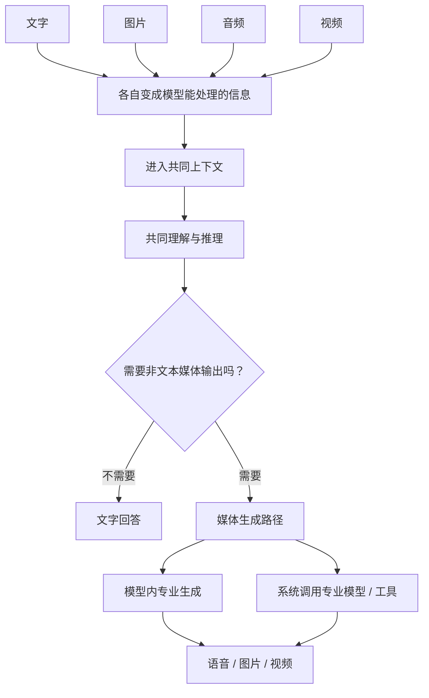

# 多模态到底统一了什么？

> 多模态不是一种固定架构，也不意味着文字、图片、声音和视频最终都要塞进一个万能模型。更有用的理解方式，是分别看模型能理解哪些模态、能生成哪些模态，不同信息怎样逐渐进入同一个理解过程，以及最终的能力由一个模型还是整个系统完成。

---

最近看 Seedance 2.5，又和别人聊到多模态时，我发现自己虽然看过不少相关模型发布，几个最基础的问题却一直混在一起：一个模型能看图片，已经算多模态了吗？能看图但不能画图，和既能理解图片又能生成图片，差别到底在哪里？以前明明早就有语音识别和视频算法，为什么今天又专门强调“多模态大模型”？如果模型越来越强，是不是最后所有能力都会进入一个什么都能做的模型？

后来我发现，与其争论某个模型算不算“真正的多模态”，不如先问三个更具体的问题：**它能理解哪些模态、能原生生成哪些模态，以及这些不同信息，是怎样从各自处理逐渐进入同一个理解和推理过程的。**

## 一、多模态不是 AI 第一次会看图、听声音

这篇文章先采用一个简单的工作口径：把**文字、图片、音频和视频**看作四类基础模态。“模态”可以先理解成信息原本的形态：文字主要是一串符号，图片包含二维空间结构，声音随时间变化，视频则同时包含空间、运动、事件顺序和前后状态。

语音有时会被单独列出来，但它本质上仍属于音频，只是还承载语言内容、音色和语调，所以工程上经常特殊处理。PDF、PPT 这样的文档则更像信息容器，里面可以同时出现文字、图片、表格和版式。厂商完全可以把 Document 单独列成一种产品输入，但本文不会因此把 PDF 视为和图片平级的第五种基础模态。

AI 能处理图片、声音和视频，当然也不是大模型时代才开始。语音识别、目标检测和视频跟踪早已存在。变化更多发生在**任务边界和能力复用方式**上。

| **比较维度** | **单任务模型** | **基础模型** |
|---|---|---|
| **任务怎么定义** | 任务通常预先固定 | 在更宽任务空间按指令工作 |
| **输入与上下文** | 围绕特定数据和接口 | 可带入更丰富上下文，部分模型跨模态 |
| **输出空间** | 转写、类别、坐标等预定义结果 | 开放文本或图片、声音、视频等内容 |
| **换一个任务** | 常需专项模型或重新训练 | 更常通过指令、上下文或轻量适配迁移 |
| **典型例子** | ASR、目标检测 | Claude、Qwen、Sora、Seedance |

*这是本文为了比较任务范式做的简化，不是严格的行业二分。“基础模型”也不等于“多模态模型”。*

这里还需要区分**“任务单一”和“模态专业化”**。Sora、Seedance 虽然都高度专注视频，但面对的是开放式生成任务，并不是只完成某一个预定义任务的单任务模型。2024 年的 Sora 就是一个代表性节点：OpenAI 把可扩展的视觉表示、Transformer 和大规模训练用于通用视频生成，探索视频生成模型能否像语言模型一样继续从规模扩展中获益。[OpenAI：Video generation models as world simulators](https://openai.com/index/video-generation-models-as-world-simulators/)

所以进入基础模型范式之后，“是不是专注某一种模态”已经不能单独判断它属于哪种模型。接下来更需要拆开的，是另外两个经常被混在一起的问题：**理解一种模态，和生成一种模态，是不是同一件事？**

## 二、能看懂，和能生成，是两件不同的事

假设我上传一张销售图表，再问：“为什么这里突然下降？”模型看懂图里的信息，结合文字问题分析，最后仍然用文字回答。这已经属于**多模态理解（Multimodal Understanding）**：

**文字 + 图片 → 理解和推理 → 文字**

输出只有文字，并不妨碍它成为多模态模型。DeepSeek 在 2026 年 8 月上线的 V4-Flash-Vision-Exp 就是一个直接例子：它可以同时接收文字和图片，用来描述图片、读取截图文字和分析图表。[DeepSeek：Vision](https://api-docs.deepseek.com/guides/vision/)

Claude 也属于类似的理解侧案例。它可以查看和分析用户上传的图片，但 Anthropic 目前仍明确说明，Claude 本身不像图像生成工具那样生成照片或插画。换句话说，**一个模型可以已经是多模态的，同时仍然主要生成文字。** [Anthropic：Can Claude produce images?](https://support.claude.com/en/articles/9002504-can-claude-produce-images)

生成是另一侧。文字生成图片、图片生成视频，输入和输出已经跨越了模态；像 Seedance 2.5 这样的专业生成模型，还可以同时使用图片、已有视频和音频作为参考，再生成新的音视频内容。这里不仅要理解素材，还要真正创造新的媒体，并维持人物、动作、声音和画面的关系。Seedance 2.5 官方将其称为新一代音视频生成模型，并强调多模态参考能力。[ByteDance Seed：Seedance 2.5](https://seed.bytedance.com/en/blog/one-take-creation-flexible-referencing-introducing-seedance-2-5)

这两种能力需要的信息也不完全一样。判断一张照片里是不是猫，抓住对象、关系和语义可能已经足够；真正生成一张猫的照片，却还要创造毛发、纹理、光影和空间细节。生成视频又进一步增加人物身份、物体状态、运动和时间连续性。

**因此，多模态理解和多模态生成不能混成同一种能力。** 判断一个模型时，先分别问“它能理解哪些模态”和“它能原生生成哪些模态”，很多看起来复杂的差异已经能解释一半。

但无论是理解还是生成，文字、像素、声波这些结构完全不同的信息，都要先变成模型能够处理的形式。于是下一个问题变成：**这些信息怎样从各自处理，逐渐进入同一个任务？**

## 三、“统一”不是一个开关，它可以发生在中间

对于通用多模态理解模型，一条简化的信息流可以这样表示：

*这是一张帮助理解的认知地图，不是行业统一架构。不同模型具体怎样编码、怎样组合信息，并不一定对应图中几个泾渭分明的模块。Sora、Seedance 这样的专业生成模型也可以直接沿自己的生成链路工作，不要求先经过图中的通用理解路径。*

图里的“进入共同上下文”和“共同理解与推理”不是二选一，而是前后两个层次。**进入共同上下文**强调不同来源的信息已经能被同一个模型过程访问：比如图片里的销售曲线和用户输入的问题同时摆在模型面前。**共同理解与推理**则更进一步，强调模型真正把这些信息结合起来完成任务：它不仅看见曲线下降，也会结合问题和其他信息分析下降可能意味着什么。

再往前看，文字、图片、声音和视频的原始结构本来就不同，所以它们不必从输入开始就走完全一样的路径。视觉信息如何变成语言模型能够继续利用的信息，本身就是一个独立问题。DeepSeek-OCR 研究的就是怎样用更少的视觉表示承载高密度视觉信息，再交给后续语言模型处理。[DeepSeek：DeepSeek-OCR](https://github.com/deepseek-ai/DeepSeek-OCR) 这个例子更适合说明输入侧仍然可以专业化，而不是说明多模态已经完成了统一。

真正的汇合发生在不同信息开始被一起利用之后。相比先让视觉、语音模型各自完成任务，只把文字、标签或其他中间结果交给语言模型，多模态模型可以让更多来自原始模态的信息直接参与后续理解和推理。

GPT-4o 在 2024 年把这个变化表现得很直观。在它之前，ChatGPT 的语音模式需要“语音转文字 → 语言模型 → 文字转语音”三个模型接力；语气、多人说话和背景噪音等信息会在转成文字之后丢失一部分。GPT-4o 则被训练成一个跨文字、视觉和音频端到端处理的模型，OpenAI 明确表示所有输入和输出都由同一个神经网络处理。[OpenAI：Hello GPT-4o](https://openai.com/index/hello-gpt-4o/)

但 OpenAI 没有公开足够细的 GPT-4o 内部结构。因此，我们可以确认它把多种模态收进了同一个端到端模型，却不能继续推断它内部不存在视觉、音频或输出侧的专业处理。

Qwen2.5-Omni 和 GPT-4o 的方向接近，但公开的内部结构更具体。Qwen2.5-Omni 可以处理文字、图片、音频和视频，并生成文字与自然语音；它的输入侧仍包含图像和音频编码器，中间由 Thinker 综合不同模态的信息，需要生成语音时，再由 Talker 接手。[Qwen：Qwen2.5-Omni](https://qwenlm.github.io/blog/qwen2.5-omni/)

这里不需要记住 Thinker 和 Talker 两个名字。更重要的是它公开展示了一种很直观的关系：**输入可以先专业化，中间共同理解，输出时再重新专业化。** 也就是说，端到端统一和内部专业分工并不矛盾。理解之后，如果任务只需要回答问题，模型可以直接输出文字；如果还需要语音、图片或视频，则可以继续在同一个模型内部生成，也可以把生成工作交给系统中的专业模型。

**多模态的“统一”可以发生在中间，而不要求输入和输出也全部统一。**

不过到这里讨论的主要还是模型本身。到了真正的 AI 产品里，还要再多问一层：**用户看到的多模态能力，真的是主模型自己完成的吗？**

## 四、产品支持一种模态，不等于主模型原生支持它

我看到 DeepSeek V4 Flash Vision 发布时，就有过一个很自然的疑问：**DeepSeek 以前不是已经可以上传文件了吗？** DeepSeek 在 2025 年发布 App 时，官方确实已经把“文件上传与文本提取”列为核心功能之一，当时 App 由 DeepSeek-V3 驱动。[DeepSeek：Introducing DeepSeek App](https://www.deepseek.com/news/deepseek-app/)

但“产品能上传文件”和“V3 能直接理解图片”不是一回事。文件上传可以先经过文档解析或文字提取，再把得到的文本交给语言模型；而当前的 V4-Flash-Vision-Exp 明确把图片本身作为模型输入，DeepSeek 文档也明确区分，只有 Vision 模型接受真实图片输入。[DeepSeek：Vision](https://api-docs.deepseek.com/guides/vision/)

**产品可以接收文件或图片，不等于主模型原生具备视觉理解。**

输出侧有一个几乎对称的例子。以当前公开能力为例，GPT-5.6 Sol 支持文字和图片输入、文字输出，其中图片是 Input only，Audio 和 Video 不属于模型自身支持的模态；但 GPT-5.6 Sol 在 Responses API 中支持图像生成工具。真正原生支持图片输入和输出的，是独立的 GPT Image 2。[OpenAI：GPT-5.6 Sol](https://developers.openai.com/api/docs/models/gpt-5.6-sol) [OpenAI：GPT Image 2](https://developers.openai.com/api/docs/models/gpt-image-2)

所以“GPT-5.6 能帮我生成一张图片”和“GPT-5.6 本身是图像生成模型”同样不是一回事。

| **用户看到的产品能力** | **不能直接推出的结论** |
|---|---|
| **可以上传文件 / 图片** | 主模型原生具备对应视觉能力 |
| **可以生成图片** | 主模型原生拥有图片输出能力 |

本文把这种**统一体验由多个模型、工具或组件共同完成**的形态称作“系统层多模态”。这是为了分析方便采用的工作定义，并不是 OpenAI、DeepSeek 等厂商对自身架构的官方命名。

这也解释了一个看起来有点反直觉的现象。上一章的 GPT-4o 在 2024 年明确强调一个模型端到端处理文本、视觉和音频；而今天作为旗舰通用模型的 GPT-5.6 Sol，公开的原生模态是文字和图片输入、文字输出，却可以通过图像生成等工具组合出更丰富的产品能力。[OpenAI：GPT-4o System Card](https://openai.com/index/gpt-4o-system-card/)

**模型更强，不意味着原生模态一定更多；产品体验更统一，也不意味着底层一定越来越接近“一个模型包办所有事情”。**

第三章和第四章放在一起看，关系也就清楚了：模型内部可以让不同模态越来越直接地共同参与理解，系统外部也可以继续保留专业模型分工。两条路线可以同时存在。

## 五、所以，多模态到底统一了什么？

多模态统一，并不是把文字、像素、声波和视频变成完全相同的数据。它们的原始结构依然不同，输入端继续保留不同处理方式、输出端继续使用专业生成能力，都很正常。

真正变化的是**不同信息参与同一个任务的方式**。过去，一段声音可能先被完整转成文字，图片也可能先由独立模型提取标签或文本，再把这些中间结果交给语言模型。每多一次转换，原始模态里的一部分信息就可能留在前一道处理中。现在，越来越多视觉、声音和视频信息能够更直接地进入共同上下文，与文字一起参与理解和推理；需要生成图片、语音或视频时，又可以根据任务继续在模型内部生成，或者交给专业模型。

**多模态真正统一的，未必是所有数据形式、模型和处理路径，而是不同类型的信息能够更直接地参与同一个任务。**

我现在更倾向于把它看成一次**信息边界的重新划分**，而不是一次“模型数量归零”。输入端可以继续尊重图片、声音和视频各自的特点，中间让真正需要互相利用的信息汇合，输出端再根据任务决定是否保留专业分工。最终有几个模型，反而不是最值得纠结的问题。

所以以后再看到一个模型或产品说自己是“多模态”“Omni”或者“统一理解与生成”，我真正会关心的还是三个问题：**它能理解哪些模态？能原生生成哪些模态？这些能力是在一个模型内部完成，还是整个系统组合了几个专业模型？**

这三个问题回答清楚以后，“多模态”本身就没有那么神秘了。

而它也自然留下下一篇的问题：**既然不同模态已经能共同参与越来越多理解和推理任务，为什么到了生成端，视频仍然如此专业和困难？**

---

## 参考资料

### 一手文件 / 官方发布

- [OpenAI：Hello GPT-4o](https://openai.com/index/hello-gpt-4o/)
- [OpenAI：GPT-4o System Card](https://openai.com/index/gpt-4o-system-card/)
- [OpenAI：Video generation models as world simulators](https://openai.com/index/video-generation-models-as-world-simulators/)
- [OpenAI：GPT-5.6 Sol](https://developers.openai.com/api/docs/models/gpt-5.6-sol)
- [OpenAI：GPT Image 2](https://developers.openai.com/api/docs/models/gpt-image-2)
- [DeepSeek：Introducing DeepSeek App](https://www.deepseek.com/news/deepseek-app/)
- [DeepSeek：Vision](https://api-docs.deepseek.com/guides/vision/)
- [DeepSeek：DeepSeek-OCR](https://github.com/deepseek-ai/DeepSeek-OCR)
- [Qwen：Qwen2.5-Omni](https://qwenlm.github.io/blog/qwen2.5-omni/)
- [ByteDance Seed：Seedance 2.5](https://seed.bytedance.com/en/blog/one-take-creation-flexible-referencing-introducing-seedance-2-5)
- [Anthropic：Can Claude produce images?](https://support.claude.com/en/articles/9002504-can-claude-produce-images)
