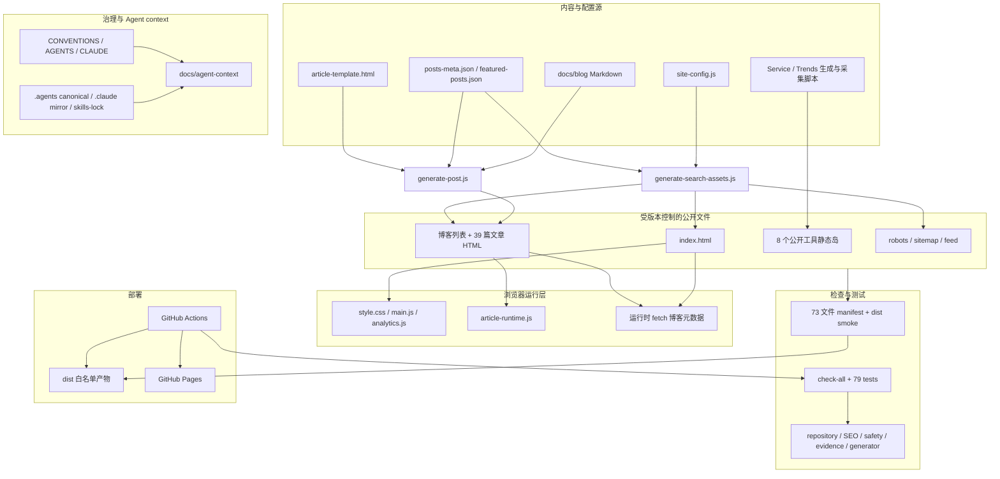
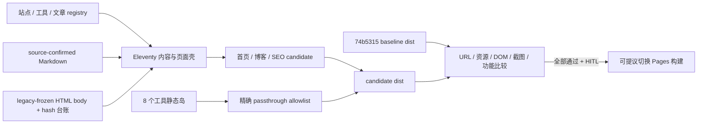

# 个人网站架构重构执行计划

> **状态：待用户确认，不得直接执行。** 后续执行必须先使用 `/executing-plans`，并在独立 worktree 的 `codex/personal-site-architecture` 分支完成。本文不授权修改 `main`、公开 UI、workflow、GitHub 设置或线上站点。

**基线：** `origin/main` = `74b531562ff14a5c38830c0edf88304af9f19933`（2026-08-19 已 fetch 验证）

**目标：** 在不改变公开 UI、URL 和工具行为的前提下，建立可维护的静态生成架构与可证明的等价门禁。

**推荐架构：** Eleventy 混合静态架构；以轻模板层的迁移节奏实施，公开工具保持精确白名单静态岛。

**技术边界：** 生产端仍为纯静态 HTML/CSS/Vanilla JS；Node/Eleventy/Playwright 仅属于开发与构建层。

---

## 1. 当前事实与证据

### 1.1 已验证基线

- 远端 `origin/main` 与要求的基线 SHA 完全一致：`74b5315`。
- `npm run check` 通过：10 个 `node:test` 文件、79 项测试全部通过。
- repository policy 通过：298 个 tracked files。
- 当前 Pages 构建只复制显式公开清单：73 文件，即 34 个固定文件和 39 篇博客 HTML。
- `dist/` 被忽略且只作为部署产物；workflow 运行检查、构建、dist smoke 后上传 Pages artifact。
- 静态安全检查当前给出 266 个启发式信号；它们是 report-only 线索，不等同于 266 个漏洞。
- generator contract 当前仍报告 4 个已知信号：博客、Service Agent、Trends 的直接写入与 Trends partial-failure 风险。

关键本地证据：

- `scripts/public-dist-manifest.js`
- `scripts/build-public-dist.js`
- `scripts/check-public-dist.js`
- `scripts/check-all.js`
- `scripts/generator-contracts.js`
- `.github/workflows/deploy.yml`
- `docs/plans/2026-07-31-track-a-handoff.md`
- `docs/plans/2026-07-31-generator-safe-migration.md`

### 1.2 当前架构图


### 1.3 公开页面、工具与数据边界

| 层 | 当前组成 | 观察 |
|---|---|---|
| 首页 | `index.html`、`style.css`、`main.js`、`interview.js`、`analytics.js` | Writing 初始为空并运行时 fetch；仍加载无对应 DOM 的 `interview.js` |
| 博客 | 列表页、39 篇生成/历史文章、两份 JSON、共享 runtime | 39 篇文章仅 21 篇有精确同 slug Markdown；历史 shell 漂移明显 |
| 工具 | Agent Hub、AI Insights、ASCI、ESOP、Radar、Service Agent、Stock、Trends | 技术形态各异但都可作为独立静态岛保留 |
| 数据 | 博客 JSON、products、trends、ASCI data、页面内嵌数据 | 元数据来源分散，尚无统一 route/tool registry |
| 生成器 | 博客、搜索资产、Service Agent、Trends、一次性迁移脚本 | check/candidate/write 契约不统一 |
| 测试 | Node tests、语法/JSON、SEO、安全、evidence、dist smoke | 缺少真实浏览器、截图、DOM/ARIA、移动端与 a11y 门禁 |
| 部署 | 73 文件 manifest → `dist/` → Pages | 白名单边界可靠，但未检查孤儿公开资源 |
| Agent context | 共享规范、8 个项目 Skill、17 个锁定设计 Skill | 镜像同步正常；部分 Skill 与新部署/安全边界漂移 |

### 1.4 重复、耦合、漂移与难维护点

优先级 P0：

1. **没有“公开 UI 等价”证明。** 现有检查通过仍不能排除视觉、交互、ARIA 或移动端回归。
2. **博客正文源映射不完整。** 39 篇公开文章中只有 21 篇存在精确 `docs/blog/<slug>.md`；另有 legacy/variant 文件，不能猜测性批量重生。
3. **生成器默认写入语义不统一。** 除 4 个已报告信号外，`scripts/add-analytics-reference.js` 也是不在契约范围内的批量 HTML 写入器。

优先级 P1：

1. 39 篇文章 HTML 合计约 1.42 MB，内联 CSS 有 29 个不同 hash，模板漂移显著。
2. 首页和博客列表分别在客户端实现 featured/metadata 解析和 DOM 拼接，内容发现依赖 JS 成功。
3. `style-light.css` 与 `style.css` 高度重复且无页面引用，仍在公开 manifest；`interview.js` 也疑似公开孤儿资源。本阶段只记录，不删除。
4. 51 个文件存在 54 个根绝对本地引用；当前用户站根路径可用，但若仓库改为 project Pages，`/repo-name/` base 会破坏这些引用。
5. 8 个公开工具均未进入统一 canonical/JSON-LD/sitemap 路由模型。
6. `npm run check` 与部署期 `build:public`/`check:public-dist` 是两个 profile，Skill 与本地交付流程未统一表达。
7. README/部分计划仍使用“无构建”描述；准确说法应是“生产运行时零依赖，开发/发布已有 Node 构建与检查”。

优先级 P2：

1. 静态安全扫描的“公开”集合与 73 文件真实部署边界不是同一个来源。
2. `docs/repository-policy.md` 的历史 Secret 描述与当前静态客户端安全规则存在局部漂移。
3. `docs/HOMEPAGE.md` 的区块次序和 Writing 数据说明已落后于当前实现。

## 2. 目标与非目标

### 2.1 目标

- 统一首页、博客、SEO 和公开路由的数据/模板来源。
- 保留全部现有公开 URL、工具独立运行能力与 GitHub Pages 静态交付方式。
- 把构建输出限定在 candidate/dist，不让默认命令原地覆盖公开源文件。
- 建立 baseline/current/candidate 的 URL、资源、DOM/ARIA、截图和功能等价门禁。
- 为博客增长、工具 metadata、SEO 与内容发布提供可验证的单一构建入口。
- 明确 source-confirmed 与 legacy-frozen 文章，正文完整性优先于模板统一速度。

### 2.2 非目标

- 不重写公开文案、区块顺序、颜色、字体、间距或组件外观。
- 不将工具业务逻辑改写成框架组件。
- 不迁移或清空 localStorage。
- 不删除疑似孤儿文件；清理需单独证据与 HITL。
- 不同时执行项目/仓库/域名改名。
- 不修改 workflow、merge、push 或部署，除非后续单独批准。
- 不在架构分支执行 Track C。

## 3. 方案比较与评分

下表是基于本地审计和官方能力资料的**主观方向性初评**，不是 PoC 或历史维护数据得出的实证 benchmark。评分 1–5，越高越好；“视觉回归风险”和“迁移成本”均按风险/成本越低得分越高。权重可由用户调整，A1 后必须用真实 candidate 数据重新评分；总分只帮助比较，不能单独授权采用 C。

| 维度 | 权重 | A Vanilla 模块化 | B 轻模板/构建层 | C Eleventy 混合 SSG |
|---|---:|---:|---:|---:|
| 长期维护成本 | 20% | 2.5 | 4.0 | 4.5 |
| 视觉回归风险 | 15% | 4.5 | 4.0 | 3.5 |
| GitHub Pages | 10% | 5.0 | 4.5 | 4.5 |
| SEO | 10% | 3.0 | 4.0 | 4.5 |
| 博客扩展 | 20% | 2.5 | 4.0 | 5.0 |
| 工具独立运行 | 10% | 5.0 | 4.5 | 4.5 |
| 可测试性 | 10% | 3.0 | 4.0 | 4.5 |
| 迁移成本 | 5% | 5.0 | 3.5 | 2.5 |
| 加权总分 | 100% | **3.53** | **4.08** | **4.35** |

### A. 保持零依赖 Vanilla 并模块化

- 优点：迁移面最小；GitHub Pages 与工具独立性天然保持；无新增供应链。
- 缺点：博客集合、模板、路由、SEO 和生成器契约仍需长期自研；客户端 include 会削弱无 JS 与 SEO。
- 适用：用户把最低短期风险置于博客长期扩展之上时，作为保底方案。

### B. 引入轻量模板/构建层

- 形态：Nunjucks/Handlebars 或项目自有编译入口只管理首页、博客 shell、SEO 和 registry；工具原样复制。
- 优点：DOM 等价较易控制，能分批迁移，首次成本中等。
- 缺点：collection、data cascade、路由和插件契约继续由项目维护，可能形成新的自研生成器群。
- 适用：作为 C 的迁移中间态，或用户明确不接受成熟 SSG 时的目标方案。

### C. 使用成熟静态站点生成方案

- 推荐形态：Eleventy 只管理首页、博客、SEO 与 registry，8 个现有工具精确 passthrough。
- 优点：贴合现有 HTML/Markdown/Node；成熟 collections、data cascade、layout 与静态输出；不引入浏览器运行时框架。
- 缺点：首轮依赖、构建与 workflow 变化更大；历史文章源不完整使迁移需要冻结台账。
- Astro/Hugo 作为对照：Astro 对组件化/内容 schema 更强但首轮迁移面更大；Hugo 构建快但模板语言与现有 Node 工具链割裂。

## 4. 推荐目标架构（待确认）

暂推荐 **C 作为长期目标，B 作为实施节奏**：先建等价 harness 和 candidate-only 轻桥接，再把经验证的首页/博客壳交给 Eleventy；工具始终是独立静态岛。该推荐在 A1 结束时设置一次“继续 C / 降级到 B / 回退 A”的复评 HITL，未通过复评不得进入 A2。



管理边界：

- Eleventy 接管：首页、博客列表、文章 shell、SEO head、RSS、sitemap、公开 route/tool registry。
- 工具保持原样：AI Insights、ASCI、ESOP、Radar、Service Agent、Stock、Trends、Agent Hub。
- 首轮保留：`posts-meta.json`、`featured-posts.json`、`site-config.js`、现有 URL 与目录。
- 文章分级：
  - `source-confirmed`：Markdown 与当前 HTML 正文 hash 对应；
  - `legacy-frozen`：以当前 HTML 正文为冻结源，不猜测替换；
  - `blocked`：无法证明来源，需人工确认。
- 默认命令只写 candidate；promote 必须显式、可审计且受 HITL 控制。
- 禁止宽泛复制整个 `tools/`；部署边界继续来自精确 allowlist。

## 5. 文件级影响范围

以下仅是未来预计范围，本轮均不修改。

### 5.1 可能新增

- 根级 `package.json` 与 lockfile（名称待改名决策后确定）。
- `eleventy.config.*`。
- `src/site/`：layouts、includes、data、pages、posts adapter。
- `tests/equivalence/`：双服务器、route/resource/DOM/ARIA/截图/功能测试。
- `scripts/site-routes.*` 或等价 registry。
- `docs/blog/source-map.json` 或等价 source-status/body-hash 台账。
- 本地忽略的 `build/architecture-equivalence/{baseline,candidate,report}/`。

### 5.2 可能修改

- `scripts/public-dist-manifest.js`
- `scripts/build-public-dist.js`
- `scripts/check-public-dist.js`
- `scripts/generate-search-assets.js`
- `scripts/check-all.js`
- `scripts/generator-contracts.js`
- `tools/blog/generate-post.js`
- `tools/service-agent/gen_index.js`
- `scripts/fetch-trends.js`
- `CONVENTIONS.md`、`docs/repository-policy.md`、`docs/agent-context/*`
- 相关项目 Skill 及其 `.claude` 镜像。
- `.github/workflows/deploy.yml`：只能在最后独立 HITL 后考虑。

### 5.3 不应修改

- 8 个工具的业务交互与 mock 边界。
- 现有 localStorage 数据或 key。
- 公开 URL、正文、项目证据声明。
- Track C 视觉与内容决策。

## 6. 分支、worktree 与依赖关系

```text
origin/main@用户批准的 SHA
  └─ codex/personal-site-architecture
       ├─ baseline/current/candidate 等价门禁
       ├─ candidate-only 构建
       └─ 用户签字确认 architecture SHA
            └─ codex/track-c-ui-prototypes
```

执行规则：

1. 执行当日再次 `git fetch origin main`；若远端已不再是本计划证据基线，先产出差异审计并暂停。
2. 新建独立 worktree，绝不在 `main` 上写入。
3. 架构分支未完成全部等价门禁前，不得创建 Track C 原型分支。
4. 原型分支必须从用户确认的 architecture SHA 分出，而不是从旧 main 或中间提交分出。
5. 任何 workflow、merge、push、Pages 更新均是独立 HITL。
6. 本计划只存在于 planning worktree 时，执行 Agent 必须从其绝对路径只读加载；不得为了“让计划可见”把架构分支改从 planning 分支派生或擅自 cherry-pick。计划文档是否进入 main 另行确认。

关键依赖：

- 决策 D1：接受 A、B 还是推荐的 C。
- 决策 D2：允许哪些开发依赖与 lockfile。
- 决策 D3：legacy 博客冻结策略。
- D1–D3 → 等价 harness → candidate 骨架 → 首页 → 博客 → 工具/生成器 → 治理/发布决策。
- Track C 依赖 architecture SHA 完成验证；项目/域名改名不与架构迁移并行。

## 7. 执行批次（每批最多 3 项）

### Batch A0：冻结基线与门禁，2–4 天

1. 固化 `74b5315` 的 73 文件、49 个 HTML URL、资源请求、状态与主要交互状态清单。
2. 建立 Playwright baseline/current 双服务器及稳定化配置，并只定义尚未启用的 candidate adapter contract。
3. 产出 baseline↔current 的桌面/移动、明暗主题 DOM/ARIA/截图/功能自比较报告。

交付条件：只增加测试基础设施，不改变公开页面；baseline↔current 自比较必须零差异。A0 不声称已有 candidate。

### Batch A1：candidate 构建骨架，2–3 天

1. 增加锁定版本的 Eleventy 与 candidate-only 配置。
2. 把 73 文件规则转成 generated/passthrough route contract，仍精确白名单。
3. 验证连续两次构建的 route set 与 hash 确定性。

交付条件：candidate 可构建；现有源文件与 public dist 未被默认命令覆盖；启用第三端比较并以实际依赖、输出与等价数据重新评分，HITL 决定是否进入 A2。

### Batch A2：首页等价迁移，2–4 天

1. 将首页 shell/head/data 转为模板，保持规范化 DOM 等价。
2. 把 Writing 构建期预渲染，同时保留必要的客户端增强/兼容行为。
3. 运行首页 URL、资源、截图、键盘、移动菜单、主题和展开状态比较。

交付条件：无意图外前台变化；任何像素差异必须列入 HITL。

### Batch A3：博客等价迁移，4–8 天

1. 为 39 篇文章建立 source-status/body-hash 台账。
2. 迁移博客列表与 article shell；legacy 正文保持冻结。
3. 验证正文 hash、SEO、RSS、sitemap、筛选/搜索、TOC、关系导航和继续阅读。

交付条件：39 篇正文完整性全部有机器证据；未知映射不被重生。

### Batch A4：工具与生成器契约，3–5 天

1. 让 8 个公开工具通过精确 passthrough、根路径/base、主路径与空/错态 smoke。
2. 为博客、Service Agent、Trends 建立 `--check`/candidate/显式 write 或等价契约。
3. 将批量写入脚本与孤儿资源列入单独处置提案；不自动删除。

交付条件：生成器默认不覆盖公开文件；工具业务 hash/行为无意图外变化。

### Batch A5：治理与发布选择，2–4 天

1. 完成浏览器、视觉、a11y、安全、HTML 和性能基线报告。
2. 同步规范、repository policy、Agent context、Skill 和 handoff。
3. 用户决定是否允许 workflow 切换、合并、push 与 Pages 验证。

交付条件：没有用户批准时停留在本地分支；不触碰 GitHub。

## 8. “公开 UI 等价”验收方法

### 8.1 比较拓扑与稳定化

- Baseline：精确 checkout 已批准 SHA，端口 A。
- Current：架构分支中尚未迁移的参照构建，端口 B；用于发现 harness 自身漂移。
- Candidate：A1 才产生的架构候选输出，端口 C；A0 只验证 adapter contract，不伪造第三端结果。
- 固定 Chromium 版本、`zh-CN`、`Asia/Shanghai`、字体、缓存策略。
- 视口至少 `1440×1000` 与 `390×844`；重要页面补 `768×1024`。
- 等待 `document.fonts.ready`，关闭动画/transition/caret，屏蔽分析网络请求。
- 每个测试显式初始化 theme/localStorage；外部 API 统一 fixture/mock，禁止真实 key。

### 8.2 五层硬门禁

| 层 | 比较内容 | 架构分支通过标准 |
|---|---|---|
| URL/文件 | 73 文件、49 HTML 路径、status、MIME、canonical、RSS、sitemap | 路径集合无丢失；新增/删除需单独批准 |
| 资源 | 浏览器实际请求、404、第三方请求、hash、大小 | passthrough 资源 hash 相等；无新增未知请求 |
| DOM/语义 | 规范化 DOM、head、ARIA snapshot、文本/链接/ID/class | 除显式 allowlist 外相等；可访问名称不退化 |
| 截图 | full-page、关键组件、baseline/candidate/diff/side-by-side | 同环境以 0 像素差为目标；任何例外人工复核并 HITL |
| 功能 | 导航、主题、展开、筛选、搜索、分页、工具主/错态 | 无 console/pageerror/失败请求；输入输出与 storage 等价 |

同时在根路径和模拟 `/repo-name/` base 运行，提前暴露仓库改名风险。

### 8.3 代表性状态矩阵

- 首页：顶部、滚动后导航、移动菜单开/关、明/暗、判断展开、案例展开、文章/工具跳转。
- 博客列表：默认、精选、每类筛选、搜索有/无结果、分页、明/暗。
- 文章：当前模板一篇、legacy shell 至少两篇、长文、含参考资料/关系导航各一篇。
- 工具：8 个工具各一个主路径与一个空/错/降级状态；Stock/Service 保持 Mock，ESOP 不使用真实 key。
- 自动 a11y：axe 作为扫描；键盘、焦点、触控目标、缩放与屏幕阅读器语义保留人工复核。
- Lighthouse：首轮 report-only 建基线；阈值待同环境数据稳定后由用户确认。

## 9. 回滚方案

- 所有候选输出写入本地忽略目录，不覆盖 baseline 源。
- 每批独立提交；失败时只撤销该批提交，不使用 `reset --hard`。
- 架构切换前保留旧构建入口和 73 文件 manifest；candidate 未通过时继续使用旧 pipeline。
- 如果未来 workflow 已获批切换，保留上一个已验证 artifact/SHA；异常时通过新的回退提交恢复旧构建，而不是 force push。
- legacy 正文以 hash 台账保护；任何 hash 不符立即阻断，不自动修复。
- localStorage key 不变；如未来必须迁移，采用双读/单写、版本化与回退窗口，另立计划。

## 10. HITL 节点

| 节点 | 必须确认的事项 | 未确认时行为 |
|---|---|---|
| H1 | 目标选 A/B/C；推荐先批准 C 的 A0–A1 PoC | 不创建架构分支 |
| H1b | A1 真实数据后选择继续 C、降级 B 或回退 A | 不进入 A2 |
| H2 | 根级 package/lockfile 与 Playwright/Eleventy/axe 等开发依赖 | 不安装依赖 |
| H3 | legacy 博客冻结/补源策略 | 不批量生成文章 |
| H4 | 截图基线是否入 Git、像素 allowlist 与浏览器矩阵 | 只做本地报告 |
| H5 | 孤儿资源是否删除、localStorage 是否迁移 | 只记录，不删除/迁移 |
| H6 | 是否修改 `.github/workflows/` | 保持现有部署链 |
| H7 | merge、push、Pages 更新 | 停在本地分支 |

## 11. 工作量与时间范围

- 推荐 C 的架构阶段：约 **15–28 个工作日**（A0–A5 区间直接相加；并行压缩需另有证据）。
- 最小可验证里程碑（A0+A1）：约 **4–7 个工作日**。
- 最大不确定项：18 篇无精确同 slug Markdown 的历史文章；若逐篇人工补源，另加 **3–8 个工作日**。
- 若选择 B，预计 **10–18 个工作日**，但长期维护成本更高。
- 若选择 A，预计 **6–12 个工作日**，主要收益来自模块边界与测试，不彻底解决内容生成治理。

## 12. 前台与 GitHub 影响声明

### 会影响前台的变化

- **本架构阶段的预期值为零。** 任一视觉、文案、顺序、URL 或交互变化都视为失败或 Track C 候选，不能混入架构提交。
- 构建期预渲染 Writing 的无 JS 降级会更完整；若它造成 DOM/加载时序差异，必须显式记录并由用户判断是否接受。

### 不会影响前台的变化

- candidate-only 构建、测试 harness、source map/hash 台账、registry、确定性检查、文档与本地报告。
- 未接入 workflow 的 Eleventy 配置和模板。

### 是否需要更新 GitHub

- A0–A5 的本地架构验证：**不需要，也不得自动更新 GitHub**。
- 只有用户在 H6/H7 明确批准后，才可能修改 workflow、合并、push 或部署；这些批准不能从本计划推定。

## 13. 对应的下一步执行 Prompt

```text
请只读加载
D:\CS\Coding\qiuzhi\.worktrees\personal-site-planning\docs\plans\2026-08-19-architecture-refactor-plan.md，
然后在 D:\CS\Coding\qiuzhi 执行其中的 Batch A0，且只执行 A0。

开始前：
1. 按 AGENTS.md 顺序读取完整共享上下文及相关 Skill；
2. git fetch origin main，报告远端 SHA；若与我批准的基线不同，先停下给出差异；
3. 记录全部 worktree、分支、stash 和未提交修改；
4. 从我批准的 main SHA 新建独立 worktree 与分支 codex/personal-site-architecture；
5. 使用 /executing-plans，并在声称完成前使用 /verification-before-completion。
6. 不从 planning 分支派生架构分支，也不擅自 cherry-pick 计划提交。

本批只建立 baseline/current 双服务器、未启用的 candidate adapter contract 和基线自比较报告：
- 不修改公开 UI、文案、URL、工具逻辑或 localStorage；
- 不安装未获我确认的依赖；
- 不修改 workflow，不 merge，不 push，不部署；
- 所有截图和 candidate 输出保持本地，除非我已明确同意纳入 Git；
- 每个提交只包含本批基础设施与文档。

结束时报告 baseline↔current 的 URL/资源/DOM/ARIA/截图/功能矩阵、candidate adapter contract、失败项、文件变化、测试证据和下一 HITL；不得声称 candidate 已存在，然后停止等待反馈。
```
