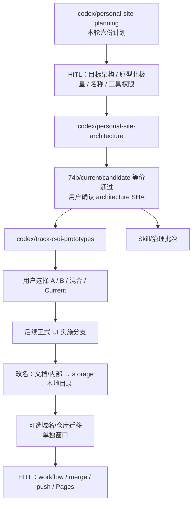

# 个人网站下一阶段总计划

> **状态：方案草案，等待用户选择。** 本轮仅完成调研、审计、架构分析与计划文档；没有实施架构重构、没有修改公开 UI、没有生成正式 Track C 页面、没有修改 GitHub、没有 push。

**规划基线：** `origin/main@74b531562ff14a5c38830c0edf88304af9f19933`

**规划分支：** `codex/personal-site-planning`

**长期推荐：** Eleventy 混合静态架构（内容/页面壳生成 + 现有工具精确白名单静态岛），按轻模板层节奏迁移。

**Track C 推荐评审：** Concept B 作为主候选、Concept A 作为安全对照；不预选、不实施。

**改名推荐：** 对外品牌 `Leo Liu`，内部 slug `leo-liu-site`，暂留 `marktian-long.github.io` 特殊用户站仓库。

**Skill 结论：** 零新增；保留现有入口、分级更新，建议暂缓 `update-trends` 与 `brand-design-md` 直至修订。

---

## 1. 本轮范围与完成定义

### 1.1 目标

- 以远端 Track A+B 完成态为事实基线，重新审计仓库、架构、Track C、改名和 Skill 治理。
- 比较三种目标架构并给出可回退的推荐。
- 规划 Current/Concept A/Concept B 的本地原型和桌面/移动验收。
- 区分品牌、项目名、内部标识、本地目录、repo、Pages URL、域名与 canonical。
- 给出可执行、每批不超过 3 项、含依赖/HITL/回滚/时间的后续计划。
- 把外部研究链接和本地证据集中归档。

### 1.2 非目标

- 不实现架构或视觉改造。
- 不改公开 HTML/CSS/JS/JSON、文章正文、manifest 或 localStorage。
- 不安装、更新或创建 Skill/依赖。
- 不修改 `.github/workflows/`、Secrets、Pages Settings、DNS、repo 名或 remote。
- 不 merge 到 main、不 push、不部署。
- 不触碰其他 Codex/Claude worktree、branch 或 stash。

### 1.3 本轮允许的唯一写入

只新增并提交以下六份计划：

1. `docs/plans/2026-08-19-personal-site-master-plan.md`
2. `docs/plans/2026-08-19-architecture-refactor-plan.md`
3. `docs/plans/2026-08-19-track-c-ui-prototype-plan.md`
4. `docs/plans/2026-08-19-project-rename-migration-plan.md`
5. `docs/plans/2026-08-19-skill-and-ecosystem-audit.md`
6. `docs/plans/2026-08-19-research-sources.md`

## 2. 当前事实与开始前证据记录

### 2.1 远端与基线

- 2026-08-19 已执行 `git fetch origin main`。
- `origin/main` 与 `FETCH_HEAD` 都是 `74b531562ff14a5c38830c0edf88304af9f19933`，提交标题为 `fix: 完善 A+B 合并门禁`。
- 本地主 worktree 的 `main` 为 `dcacea694…`，比远端 main 落后 9 个提交；它保持 clean，本轮没有在其中写入。
- 隔离 planning worktree 从 `74b5315` 创建，分支为 `codex/personal-site-planning`。

### 2.2 worktree、分支与未提交修改

创建 planning worktree 前的全部 worktree：

| 路径 | 分支 | HEAD | 状态 |
|---|---|---|---|
| `D:/CS/Coding/qiuzhi` | `main` | `dcacea694…` | clean；behind origin/main 9 |
| `.claude/worktrees/sad-galileo-1399e4` | `claude/sad-galileo-1399e4` | `826b5db…` | clean；behind 111 |
| `.worktrees/analytics` | `codex/website-analytics` | `3d8ff12…` | clean |
| `.worktrees/blog-history-retrieval` | `codex/blog-history-retrieval` | `d62e29f…` | clean |
| `.worktrees/search-foundation` | `codex/search-foundation` | `4d433ce…` | clean；有对应 remote branch |
| `.worktrees/site-trust-ab-integration` | `codex/integrate-site-trust-ab` | `74b5315` | clean |
| `.worktrees/site-trust-editorial-v2` | `codex/site-trust-editorial-v2` | `345d43a…` | clean |

另有本地分支 `codex/blog-reference-density@13620a2`；远端除 main 外可见 `origin/codex/search-foundation` 和 `origin/codex/blog-reference-density`。本轮没有切换、更新或删除它们。

现有 stash（均未触碰）：

- `pre-blog-release-main-worktree`（2026-08-08）
- `codex backup before syncing main 2026-07-26`
- `qa-pre-stash`（2026-03-29）

新建的 planning worktree：

| 路径 | 分支 | 起点 | 状态 |
|---|---|---|---|
| `D:/CS/Coding/qiuzhi/.worktrees/personal-site-planning` | `codex/personal-site-planning` | `74b5315` | 本轮只含六份计划 |

### 2.3 已读取的基线资料

已按 AGENTS 顺序完整读取：

- `CONVENTIONS.md`
- `docs/agent-context/README.md`
- `docs/agent-context/memory.md`
- `docs/agent-context/skills.md`
- `docs/agent-context/maintenance.md`
- `/brainstorming`
- `/writing-plans`
- `/dispatching-parallel-agents`

并完整读取远端基线版本：

- `docs/plans/2026-07-31-site-trust-architecture-editorial-plan.md`
- `docs/plans/2026-07-31-track-a-handoff.md`
- `docs/plans/2026-07-31-generator-safe-migration.md`

月度维护 marker 为 `next=2026-08-10`，当前已逾期；维护应另开任务执行，不能混入本计划提交。

### 2.4 基线测试

- `cmd /c npm run check`：通过。
- 10 个 Node test 文件，79/79 通过。
- repository policy：298 tracked files 通过。
- search foundation：robots/sitemap/feed、39/39 article runtime、2/2 entry SEO 通过。
- portfolio evidence：5 个记录通过。
- tracked JS 语法、11 个 JSON 解析通过。
- public manifest：73 文件，34 固定 + 39 博客 HTML。
- static client safety：266 个 report-only 信号；不能称为漏洞计数。
- generator contract：4 个已知信号，尚未完成 Track B 计划中的全部 generator 安全迁移。

## 3. 对现有 2026-07-31 计划的重新判断

### 3.1 可继续沿用

- Track A 的证据 schema、安全字段、评估人/披露边界。
- Track B 的 73 文件白名单、静态客户端 secret 边界、生成器 candidate/check/write 方向。
- Track C 必须与架构/安全解耦、先做本地原型、用户选 Concept 后才可能实施。
- 所有公开声明要区分事实、Mock、角色、证据与复核日期。

### 3.2 需要纠正/更新

- 总计划头部仍残留旧基线 `f66eeba` 和历史 dirty 描述；本轮事实基线是 clean 的 `74b5315` planning worktree。
- generator migration 文档仍以 Track B 前置任务表述，而 Track A+B 顶层状态已完成；应视为**尚未完全消化的技术债台账**，不是重新否定 A+B。
- 旧 Track C 的暖色/陶土/顺序判断被写进设计上下文，不能自动当作本轮硬约束。
- “精选文章”已部分完成；“三个旗舰上移”也不能简化为重排现有前三项。
- Current 的真实顺序与部分旧文档说明已漂移，应以 `74b5315` 源码和截图为准。

## 4. 四个主题的关键结论

### 4.1 整体架构

三个方案的主观方向性初评为：A Vanilla 模块化 3.53，B 轻模板层 4.08，C Eleventy 混合 SSG 4.35。该数字基于当前仓库证据和官方能力资料，不是 PoC/历史工时 benchmark，也不是单独的采用依据。

暂推荐：**C 作为长期目标，B 作为迁移节奏。** A1 candidate 骨架完成后必须以真实依赖、构建和等价数据复评，用户再决定继续 C、降级 B 或回退 A。

- Eleventy 只管理首页、博客、SEO、RSS/sitemap 和 route/tool registry。
- 8 个公开工具保持精确 allowlist passthrough 静态岛，不重写业务。
- A0 先建立 74b baseline↔current 自比较；A1 产生 candidate 后再启用第三端 URL/资源/DOM/ARIA/截图/功能比较。
- 39 篇文章先建 source-status/body-hash 台账；18 篇无精确同 slug Markdown 不得猜测重生。
- 架构分支的前台变化目标是零；一切有意视觉变化留给 Track C。

详见 `2026-08-19-architecture-refactor-plan.md`。

### 4.2 Track C

- Current 强写作气质，但作品证明位于较后区域，真实/Mock/角色/证据的快速扫读结构不足。
- Concept A 保留现有大顺序，修导航、可信度、精选/Start Here、对比和移动细节。
- Concept B 把 Selected Work 放到第二屏，再进入 Judgment、Writing、Labs、About/Colophon。
- 推荐把 B 作为主评审候选、A 作为低风险对照；不预选。
- 三个旗舰、本人角色、证据、Hero/CTA、作者/AI 披露均是 HITL，不从内部示例外推。

详见 `2026-08-19-track-c-ui-prototype-plan.md`。

### 4.3 项目改名

- 对外品牌、文档名、package/storage、本地目录、repo、Pages URL、域名/canonical 是独立操作。
- 推荐对外继续 `Leo Liu`，内部项目 slug 改为 `leo-liu-site`。
- 推荐暂留 GitHub repo `marktian-long.github.io`，因为它是用户站特殊仓库，维持根 URL 和现有 root-absolute 路径语义。
- 本地目录未来可改为 `D:\CS\Coding\leo-liu-site`，但必须等所有 linked worktree/会话收束，并单独 repair/rollback。
- localStorage 用双读/版本化迁移，不能直接全局替换；repo/domain 改名必须晚于架构/Track C 且一次一个主要变化。

详见 `2026-08-19-project-rename-migration-plan.md`。

### 4.4 Skill 与工程治理

- 8 个项目 Skill canonical/mirror 当前一致；17 个设计 Skill 均存在。
- 保留 6 个项目入口但更新正文；建议暂停 `update-trends`、`brand-design-md` 直至 P0 修订。
- 需要把 73 文件、candidate generator、浏览器视觉/a11y、外部不可信输入和静态 secret 边界写入 Skill。
- 优先引入脚本能力而非新 Skill：Playwright、axe、Lighthouse、HTML/link/Actions 检查、Skill provenance。
- 本轮不满足“稳定重复三次”的新增 Skill 门槛，结论为零新增。

详见 `2026-08-19-skill-and-ecosystem-audit.md`。

## 5. 文件级影响范围

### 5.1 本轮实际影响

- 只有 `docs/plans/2026-08-19-*.md` 六份新文件。
- 没有公开前台、代码、data、Skill、workflow、GitHub 或本机目录变化。

### 5.2 未来架构阶段可能影响

- 根级 package/lockfile、Eleventy config、`src/site/`、route/tool registry。
- 等价测试、文章 source map/hash 台账、public dist/check scripts、generator contracts。
- 规范、repository policy、Agent context 与相关 Skill。
- workflow 只在最后独立批准后可能改变。

### 5.3 未来 Track C 阶段可能影响

- 原型阶段只写本地 `build/track-c-prototypes/` 或未部署 prototype source。
- 用户选 Concept 后，才另行批准生产 `index.html`/模板/CSS/metadata/代表工具壳层范围。

### 5.4 未来改名与治理可能影响

- 当前性文档、未来 package、localStorage 兼容层、本机目录/worktree metadata。
- repo/domain/canonical/workflow/DNS 仅在后期独立批准。
- `.agents/skills` canonical、`.claude` mirror、skills lock/provenance 与测试脚本。

## 6. 分支、worktree 与任务依赖



规则：

1. 每个执行轮先 fetch；远端 SHA 变化则先做差异审计。
2. 架构分支从用户批准的 main SHA 建立，不能从 planning 文档提交当作生产基线。
3. Track C 必须从完成验证、用户确认的 architecture SHA 分出。
4. Skill 治理可在 architecture 尾批或独立治理分支进行；第三方 Skill 升级不与原型并行。
5. rename 不与架构/Track C 同时切换；domain/repo 永远最后且一次一个变化。
6. 无明确授权时，所有工作停留在本地 worktree。
7. 在计划文档尚未进入 main 时，后续 Agent 从 planning worktree 的绝对路径只读加载；生产分支仍从用户批准的 main/architecture SHA 建立，不因计划可见性改变分支起点。

## 7. 总执行批次（每批最多 3 项）

### Batch M0：用户决策，1–2 次会话

1. 确认架构 A/B/C，或只批准推荐 C 的 A0–A1 PoC；同时确认开发依赖与 legacy 博客策略。
2. 确认站点北极星、旗舰候选/证据和 A/B 原型范围。
3. 确认品牌/内部 slug、repo/domain 暂不改，以及 Skill 暂缓项。

输出：批准的决策记录和精确执行基线；未确认不实施。

### Batch M1：等价基础设施，2–4 天

1. 建立 `codex/personal-site-architecture` 和冻结 baseline/current。
2. 建立双服务器 URL/资源/DOM/ARIA/截图/功能 harness。
3. 完成多视口、双主题基线自比较和环境稳定性报告。

输出：零公开 UI 变化的测试基础。

### Batch M2a：candidate 骨架与复评，2–3 天

1. 增加锁定版本的 candidate-only 构建配置。
2. 建立 generated/passthrough 精确 route contract 与确定性检查。
3. 用真实依赖、构建、输出和等价数据复评 A/B/C，HITL 决定是否继续。

输出：未接生产的 candidate 骨架；未确认不得进入 M2b。

### Batch M2b：首页等价迁移，2–4 天

1. 迁移首页 shell/head/data，保持规范化 DOM 等价。
2. 构建期预渲染 Writing，保留必要客户端增强。
3. 完成首页 URL/资源/截图/键盘/移动/主题/展开对比。

### Batch M2c：博客等价迁移，4–8 天

1. 建立 39 篇 source-status/body-hash 台账。
2. 迁移列表和 article shell，冻结 legacy 正文。
3. 验证正文、SEO、RSS/sitemap、筛选、TOC 与关系导航。

### Batch M2d：工具与生成器，3–5 天

1. 验证 8 个工具的精确 passthrough、base、主路径与错态。
2. 为博客、Service Agent、Trends 建立 candidate/check/显式 write 契约。
3. 形成孤儿资源处置提案，不自动删除。

### Batch M2e：架构 handoff，2–4 天

1. 完成浏览器、视觉、a11y、安全、HTML 与性能报告。
2. 同步规范、policy、Agent context、Skill 和 handoff。
3. 用户签字确认 architecture SHA；workflow/merge/push 仍不包含在内。

输出：M2a–M2e 共约 13–24 天；连同 M1 的架构阶段共 15–28 天。

### Batch M3a：Track C 决策门，1–2 天

1. 复核 Current 与三类访问任务。
2. 整理旗舰/角色/证据/Mock 的事实表。
3. 用户确认 C-H1–C-H4，未确认不建原型分支。

### Batch M3b：Current 与 Concept A，2–3 天

1. 证明 architecture-current 与 Current 等价。
2. 生成 Concept A 独立原型。
3. 完成多视口/双主题/a11y 对比。

### Batch M3c：Concept B，2–4 天

1. 生成 B 的首页与 Selected Work。
2. 生成 Writing/Labs/About 代表状态。
3. 完成同视口、DOM/URL/资源/功能对比。

### Batch M3d：Demo 与选择，2–4 天

1. 生成三个旗舰首屏信任壳，不改核心应用。
2. 汇总 Current/A/B 选择板与五秒测试。
3. 用户选择 A、B、混合或 Current，然后停止。

输出：M3a–M3d 共约 7–13 天；没有公开 UI 变化。

### Batch M4a：发布与数据 Skill，1–2 天

1. 修订 `publish-blog`。
2. 修订 `update-trends`。
3. 修订 `analyze-product`。

### Batch M4b：页面与品牌 Skill，1–2 天

1. 修订 `add-tool`。
2. 修订 `brand-design-md`。

### Batch M4c：治理 Skill，1–2 天

1. 修订 `code-health-check`。
2. 修订 `monthly-review`。
3. 修订 `sync-docs`。

### Batch M4d：Skill 供应链，1–2 天

1. 扩展 lock 的版本/commit/许可证模型。
2. 增加 mirror/vendor provenance 只读检查。
3. 评估但不自动执行 Impeccable 升级。

### Batch M4e：选中 UI，4–12 天

1. 为用户选中的 Concept 单独制定并执行正式 UI 计划。
2. 完成视觉、a11y、SEO 和内容证据验收。
3. 用户审查本地正式候选与回滚报告；仍不自动 push。

输出：Skill 治理与选中 UI 使用不同 worktree；合计约 8–20 天，可安全并行的部分需另行批准。

### Batch M5a：内部名称与 storage，2–5 天

1. 更新当前性文档中的内部项目名。
2. 在架构需要时为新根 package 使用批准的 slug。
3. 对批准的 localStorage key 实现并验证双读兼容。

### Batch M5b：本地目录，0.5–1.5 天

1. 收束会话并冻结所有 worktree/路径状态。
2. 在独立 HITL 窗口移动主目录并 repair。
3. 验证全部 worktree/脚本/测试；失败则移回并 repair。

### Batch M5c：品牌、域名与 repo（默认分开、不自动排期）

1. 网站品牌文案只在 Track C 验收后单独批准。
2. 自定义域名只在所有权/DNS/redirect/SEO 方案确认后单独迁移并观察。
3. GitHub repo rename 默认不做；若坚持，必须晚于域名稳定且另开窗口。

输出：先内部、后本地路径；品牌、域名、repo 不是同一批实际执行，三个编号分别是独立 HITL 门。

### Batch M6：GitHub/发布决策，1–2 天 + 观察

1. 用户审查最终 diff、报告、architecture/UI/rename handoff。
2. 分别决定 workflow、merge、push、Pages/域名操作。
3. 部署后执行 canary、URL/资源/视觉/SEO 回归并保留回退 SHA。

输出：只有获得逐项授权才改变 GitHub/线上。

## 8. 测试与视觉验收总门禁

### 8.1 架构门禁：必须等价

- 73 文件与 49 个 HTML URL 集合、status、MIME。
- 真实资源请求、hash/大小、404、第三方请求。
- 规范化 DOM、head、ARIA、文本、链接、ID/class。
- Desktop `1440×1000`、mobile `390×844`，至少双主题与关键展开状态截图。
- 首页、博客、文章、8 个工具的主路径/错态、console/pageerror/localStorage。
- 根站与模拟 `/repo-name/` base。

### 8.2 Track C 门禁：允许有意差异，但必须可解释

- `1440×900`、`1280×800`、`390×844`、`320×800`，浅/深主题。
- Current/architecture-current/A/B 同页同视口对比。
- WCAG 对比、reflow、焦点、触控目标、reduced motion、键盘。
- 所有指标有类型/来源/日期；真实/Mock/限制在首次交互前可见。
- 五秒测试能回答“Leo 是谁、代表作品、从哪里开始读”。

### 8.3 发布门禁

- 全量 `npm run check` + public build + dist smoke。
- repository policy、Skill mirror/provenance、generator contracts。
- HTML/links/a11y/Lighthouse 先报告、再由稳定基线决定阻断阈值。
- 线上 canary：URL、资源、视觉、互动、canonical/sitemap/feed、404/console。

## 9. 回滚总策略

- candidate/prototype 输出只写忽略目录；默认命令不覆盖公开源。
- 每批不超过 3 项且独立提交；失败用 revert，不用 `reset --hard`/force push。
- 架构切换前保留旧 pipeline 和上一份 73 文件 manifest。
- legacy 正文用 body hash 阻断；localStorage 迁移保留旧 key 和双读窗口。
- 本地目录移动保留精确 worktree/路径清单，失败移回并 repair。
- 域名/repo 一次一个变化，保留旧 URL/redirect/回退 SHA，观察期不再改变信息架构。
- 没有 HITL 时，最强回滚是“不合并、不 push、不发布”。

## 10. HITL 决策清单

### 实现前必须确认

1. 架构：A、B 或推荐 C（Eleventy 混合）。
2. 是否允许根级 package/lockfile 与 Playwright、Eleventy、axe、Lighthouse 等 dev dependencies。
3. 18 篇无精确 Markdown 的文章：冻结现有 HTML body，还是先人工补源。
4. 截图基线：本地/CI artifact 还是提交 Git；像素例外策略。
5. 北极星：思想杂志优先，还是 Builder 作品证明优先。
6. 三个旗舰、顺序、本人角色、证据、Mock/保密边界。
7. Hero/CTA、作者/AI 协作披露可公开内容。
8. 对外品牌 `Leo Liu`、内部 slug `leo-liu-site` 是否接受。
9. 是否保留 `marktian-long.github.io` repo；推荐保留。是否已有/计划自定义域名。
10. 哪些 localStorage key 迁移；本地目录是否等所有 worktree 收束后再改。
11. 是否暂缓 `update-trends` 与 `brand-design-md`；推荐暂缓。是否保持本轮零新增 Skill。

### 之后仍需分别确认

- 删除孤儿资源。
- 修改 `.github/workflows/`、启用 Dependabot/Action。
- 合并到 main。
- push。
- GitHub repo/Pages Settings/Secrets/DNS/canonical 更新。
- 正式发布和回退。

## 11. 预计工作量与推荐时间轴

### 紧凑全职节奏：约 7–12 周

| 周期 | 重点 | 结果 |
|---|---|---|
| 第 0 周 | M0 决策、月度维护另开任务 | 冻结目标、事实与权限 |
| 第 1 周 | M1 等价 harness | 可证明 Current 的浏览器基线 |
| 第 2–5 周 | M2a–M2e 架构 candidate | 复评后形成混合候选、工具/正文等价 |
| 第 5–7 周 | M3a–M3d Track C A/B | 本地多视口选择板 |
| 第 7–10 周 | M4a–M4e Skill 治理 + 选中 UI | 分离 worktree 的本地正式候选与完整验收 |
| 第 10–12 周 | M5a–M5b 内部改名；可选 M6 发布 | 分阶段改名/发布，保持 HITL |

### 兼职稳妥节奏：约 12–18 周

- 每周只推进 1–2 个小批次；architecture 与 Track C 不交叉写公开文件。
- 域名/搜索观察期另算 4–8 周或更久，不应阻塞本地项目名清理。

推荐优先级：**等价 harness → 架构 → Track C 原型 → 选中 UI/Skill 治理 → 内部改名 → 可选域名/repo。**

## 12. 前台与 GitHub 影响声明

### 本轮会影响前台的变化

- 无。

### 本轮不会影响前台的变化

- 六份计划文档、架构评分、来源索引、分支/时间/HITL 设计。

### 未来可能影响前台

- 架构阶段目标为零可见差异。
- Track C 只有用户选中 Concept 并批准实施后才影响布局/视觉/文案。
- 品牌、localStorage、域名/repo 迁移按各自阶段影响。

### 是否需要更新 GitHub

- 按本轮交付要求，Git 范围限定为六份计划，只在本地 planning 分支提交，**不 push，不更新 GitHub**。
- 未来：workflow、merge、push、Pages、repo、DNS 必须逐项获得新确认。

## 13. 对应的下一步执行 Prompt

```text
请先审阅 D:\CS\Coding\qiuzhi\.worktrees\personal-site-planning\docs\plans\2026-08-19-personal-site-master-plan.md 及同日五份子计划，不开始实现。

请根据我的回复记录以下决策：
1. 架构选 A / B / 推荐 C；
2. 是否允许 Eleventy/Playwright/axe/Lighthouse 等 dev dependencies；
3. legacy 博客选择“冻结当前 HTML body”还是“先人工补源”；
4. Track C 北极星与 Current / Concept A / Concept B 的评审范围；
5. 三个旗舰及每项角色、证据、Mock/保密边界；
6. 品牌 Leo Liu、内部 slug leo-liu-site、保留 marktian-long.github.io 是否接受；
7. 是否已有/计划自定义域名；
8. 是否暂缓 update-trends 和 brand-design-md；
9. 截图基线保存方式；
10. 明确本阶段仍不授权 workflow、merge、push 或部署。

决策齐全后，只为 architecture plan 的 Batch A0 建立下一次执行任务。开始该任务时重新 fetch、记录全部 worktree/branch/stash/dirty state，并从我批准的精确 main SHA 创建 codex/personal-site-architecture。若远端或权限边界变化，先暂停汇报。
```
