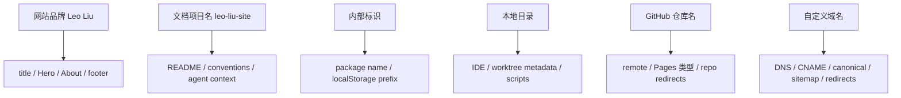

# 个人网站项目改名迁移计划

> **状态：仅盘点与方案，待用户确认。** 本轮不执行任何 rename。网站品牌、文档项目名、内部标识、本地目录、GitHub 仓库、Pages URL 和自定义域名是七类独立操作，必须分阶段验证，不得用一次全局替换处理。

**当前本地目录：** `D:\CS\Coding\qiuzhi`

**当前远端：** `https://github.com/MarkTian-Long/marktian-long.github.io.git`

**当前 canonical：** `https://marktian-long.github.io`

**推荐方向：** 对外品牌继续使用 **Leo Liu**；内部项目 slug 推荐 **`leo-liu-site`**；暂不改特殊 GitHub Pages 用户站仓库名。

---

## 1. 当前事实与证据

### 1.1 七类名称/地址盘点

| 层 | 当前值/状态 | 证据与影响 |
|---|---|---|
| 网站对外品牌 | `Leo Liu · AI / Product / Builder`，中文主体为刘洋 | `scripts/site-config.js`、首页 title/hero、生成 metadata/footer；用户可见 |
| 文档项目名称 | `qiuzhi - 个人品牌网站`，计划和历史说明混用“qiuzhi/个人网站” | `AGENTS.md`、`CLAUDE.md`、`CONVENTIONS.md`、README、plans、agent-context；治理可见，不必等于品牌 |
| package/name | 没有根级 package；`scripts/package.json` 的 name 为泛化的 `scripts` | 引入根级构建层时才需要项目 package slug；不应在架构选择前抢先改 |
| 内部标识 | 多个 `qiuzhi_*` localStorage key；博客另有 `blog_theme`/`blog-theme` | 直接替换会让浏览器现有数据“消失”；必须有兼容读取/迁移策略 |
| 本地目录 | `D:\CS\Coding\qiuzhi` | 影响终端、IDE、Codex workspace、脚本/文档路径、主仓库 `.git` 中 linked-worktree metadata |
| worktree/脚本路径 | 现有多个 linked worktree；git 管理文件记录绝对路径；少量历史文档/文件含硬编码 `D:\CS\Coding\qiuzhi` | 主 worktree 不能简单当普通目录随意移动；需先清点、关闭会话、repair 验证 |
| GitHub 仓库名 | `MarkTian-Long/marktian-long.github.io` | 这是 GitHub Pages 用户站特殊仓库名；改名会改变 Pages 类型和默认 URL 语义 |
| GitHub Pages URL | `https://marktian-long.github.io/` | 由 `scripts/site-config.js` 驱动 canonical、feed、sitemap；当前大量根绝对路径依赖站点在 `/` |
| 自定义域名 | 仓库没有 tracked `CNAME`，本轮也没有发现可验证的自定义域名配置 | 不能把候选域名当成已拥有或可用；必须单独核验 DNS/Pages 设置 |
| SEO canonical | `https://marktian-long.github.io` 及其文章 URL | 出现在 site config、生成后的页面、sitemap/feed；域名变更是 SEO 迁移，不是字符串美容 |

只读统计（用于定位范围，不建议机械替换）：

- `qiuzhi` 出现在约 31 个 tracked files。
- `marktian-long` 出现在约 65 个 tracked files，多数为生成页面、搜索资产与文档。
- `Leo Liu`/`刘洋` 出现在约 62 个 tracked files。
- 51 个公开文件含 54 个根绝对本地引用；若仓库改成 project Pages，这些 `/assets`、`/tools` 路径会失效。

### 1.2 当前 localStorage 标识

已发现的主要 key/前缀包括：

- `qiuzhi_theme`
- `qiuzhi_tracker_v1`
- `qiuzhi_stock_feedback_v1`
- 开发工具的 `qiuzhi_jobs_v1`、todo/note/collector 系列
- ESOP 的 `qiuzhi_esop_apikey`、`qiuzhi_esop_last_result`、API mode/endpoint/model 系列
- 博客主题另用 `blog_theme` 与 legacy `blog-theme`

这些 key 的数据不一定都属于公开部署，但改名前必须分类为：公开活跃、公开 legacy、dev-only、敏感/会话、可废弃。任何迁移都不得把静态客户端平台 key 持久化为长期 secret。

### 1.3 GitHub/SEO 的关键约束

- GitHub 官方说明一般仓库改名会为 Git 操作和网页访问提供重定向，但 **Pages project site URL 不随仓库重命名自动重定向**。
- 用户/组织站要求特殊仓库名 `<owner>.github.io`；当前 `marktian-long.github.io` 正是该形态。把它改成普通名称，默认 Pages URL 会从根站语义变为 `/repo-name/` project site，或失去原用户站入口。
- Google 对 URL 迁移建议：一次只做一个主要变化、建立逐 URL 映射、设置 redirect/canonical/sitemap、监控，并长期保留重定向。仓库、域名、信息架构不应同时切换。
- 当前没有可验证的自定义域名，因此最安全默认是：**先保留 GitHub 仓库名和 Pages URL。**

## 2. 改名目标与非目标

### 2.1 目标

- 让本地/文档项目名清楚表达“Leo 的个人网站”，摆脱 `qiuzhi` 过窄含义。
- 保持对外品牌、技术 slug、仓库地址和域名各自职责清晰。
- 对 localStorage、根路径、worktree、canonical 和搜索索引提供可回滚迁移。
- 用分阶段、小范围、可验证的方法替代全仓字符串替换。

### 2.2 非目标

- 不通过改名重写个人定位、Hero 或 Track C 视觉。
- 不在架构迁移同时改 GitHub repo 或域名。
- 不购买域名、不修改 DNS、Pages 设置、Git remote 或 workflow。
- 不删除旧 localStorage key、旧 redirect 或旧品牌文档痕迹。
- 不假设任何候选域名/用户名可注册。

## 3. 命名候选

内部 slug 采用小写 kebab-case；对外显示名可保持自然语言。

| 候选 | 对外显示建议 | 适合范围 | 优点 | 局限 |
|---|---|---|---|---|
| **`leo-liu-site`（推荐）** | `Leo Liu` + `AI · Product · Builder` 描述 | 本地目录、根 package、文档项目 slug | 清楚、中性、长期耐用；不把网站锁死在求职/博客/某一技术 | 较描述性，独特性一般 |
| `leo-liu-studio` | `Leo Liu Studio` | 若未来包含作品、咨询、实验与内容 | 有创作/构建感，范围宽 | 容易被理解为公司或设计工作室，需确认是否符合个人身份 |
| `leo-builds` | `Leo Builds` | Builder/作品优先的品牌 | 记忆点强，适合 Demo 和开发日志 | 弱化 Product 判断与中文写作；姓名可辨识度稍低 |
| `leo-product-notes` | `Leo's Product Notes` | 写作/产品研究优先 | 编辑定位清楚，博客导航自然 | 过窄，不足以承载完整作品集与工具生态 |
| `personal-site` | 对外仍为 `Leo Liu` | 仅作内部通用目录名 | 极其直白，迁移理解成本低 | 多项目环境下不够唯一，不适合作 package/repo 品牌 |

### 3.1 推荐

- **网站对外品牌：** 继续使用 `Leo Liu`，把 `AI · Product · Builder` 当描述语，不把技术 slug暴露为主品牌。
- **内部项目名：** `leo-liu-site`。
- **本地目录：** 未来可改为 `D:\CS\Coding\leo-liu-site`，但必须在所有活跃 worktree/对话安全收束后单独执行。
- **根 package：** 架构方案确认并新增根 package 时使用 `leo-liu-site`，而不是先改 `scripts` package。
- **GitHub 仓库：** 当前保持 `marktian-long.github.io`，因为它承载用户站根 URL；内部 slug 与远端 repo 不必相同。
- **域名：** 若未来取得自定义域名，再单独设计 canonical/redirect 迁移；本计划不推荐具体未验证域名。

## 4. 为什么这些不是同一个操作



- 改网站品牌：用户看见的内容变化，通常不改变 URL。
- 改文档项目名：治理与开发体验变化，不应自动触碰浏览器数据。
- 改 package/localStorage：运行时兼容问题，可能让用户已有数据失联。
- 改本地目录：只影响本机和 linked worktree，不会自动改 GitHub 或网站品牌。
- 改 GitHub repo：远端协作和 Pages 地址风险；不会自动改本地文件中的品牌/canonical。
- 改域名/canonical：搜索与链接迁移；可以在不改 repo 名的情况下完成。

## 5. 最安全的分阶段迁移顺序与执行批次

推荐顺序把“零前台影响”的内部整理放在前面，把 URL 迁移放在最后；同一批最多 3 项。

### Batch R0：决策与冻结，0.5–1 天

1. 用户确认对外品牌、内部 slug 与是否保留 GitHub 用户站仓库。
2. 建立名称/路径/URL/localStorage inventory 与 owner/用途表。
3. 固化当前 route、canonical、storage 与 worktree 基线。

通过条件：明确哪些字符串必须改、必须兼容、必须保留为历史证据。

### Batch R1：文档与新内部入口，1–2 天

1. 在独立 `codex/personal-site-rename` 分支更新当前性文档中的项目称谓；历史计划/commit 文本保留原名并加注释，不篡改历史。
2. 若目标架构已批准新增根 package，给新 package 使用 `leo-liu-site`；不为了改名单独制造构建依赖。
3. 更新未来脚本/报告的默认项目 slug，继续接受旧路径参数。

前台影响：无。GitHub 影响：无。

### Batch R2：localStorage 兼容迁移，1–3 天

1. 分类所有 key，制定 `old → new` 表与敏感数据边界；对 dev-only key 决定是否根本无需迁移。
2. 对需要迁移的公开 key实现版本化双读：先读新 key，不存在时读旧 key并写新 key；旧 key暂不删除。
3. 在旧/新/冲突/损坏/隐私模式下测试，并定义至少一个发布周期的兼容窗口。

前台影响：正常状态应无可见变化；错误会表现为主题/反馈/草稿丢失，因此必须浏览器验证。

### Batch R3：本地目录与 worktree，0.5–1.5 天

1. 收束或记录所有活跃 Codex/Claude 会话、linked worktree、IDE/终端与未提交状态；精确备份 `git worktree list --porcelain`。
2. 在所有相关进程关闭后移动主目录到 `D:\CS\Coding\leo-liu-site`，运行 `git worktree repair` 或官方支持的修复流程，并更新明确的本机配置。
3. 验证所有 worktree HEAD/status/remote、脚本、测试和绝对路径扫描；失败则把主目录移回原路径并 repair。

前台影响：无。GitHub 影响：无。此操作发生在分支之外，必须单独 HITL。

### Batch R4：站内品牌文案（可选），1–2 天

1. 只按用户批准的品牌文案更新 title/Hero/About/footer 与站点配置。
2. 通过 Track C 的视觉、SEO、结构化数据和多视口验收。
3. 单独提交，不混入 repo/domain 迁移。

前台影响：有；需用户逐句确认。GitHub 影响：只有之后获批 push/部署才有。

### Batch R5：自定义域名与 SEO（可选，2–4 天实施 + 4–8 周观察）

1. 先验证域名所有权、DNS、HTTPS、Pages 配置与逐 URL 映射；不与 repo rename 同时做。
2. 更新 canonical、sitemap、feed、JSON-LD、站内绝对链接和 Search Console；设置可用的旧→新重定向。
3. 上线后监控抓取、索引、404、HTTPS 和流量；重定向至少长期保留，Google 建议通常至少约一年。

前台影响：URL/分享/搜索显著变化。需要 GitHub/DNS 更新与独立授权。

### Batch R6：GitHub 仓库名（默认不执行）

1. 只有自定义域名稳定、所有根绝对路径/base 测试通过后，重新评估是否值得放弃特殊用户站仓库名。
2. 若坚持改名，先验证 Pages 新 URL、remote、Action/Settings、外部链接和 rollback；明确 GitHub 不替 Pages project URL 自动重定向。
3. 分离 repo rename、remote 更新与 Pages 切换，逐步观测，不一次完成。

推荐结果：**维持 `marktian-long.github.io` 作为基础设施名称。** 这不妨碍内部项目叫 `leo-liu-site`、对外品牌叫 `Leo Liu`、未来使用自定义域名。

## 6. 文件级影响范围

以下是未来可能范围，本轮均不修改。

### 文档/治理

- `README.md`
- `CONVENTIONS.md`
- `AGENTS.md`、`CLAUDE.md`
- `docs/agent-context/*`
- 当前性 `docs/plans/*` 与 handoff；历史计划只加迁移注解，不做全文替换。
- `.agents/skills/*` 及 `.claude/skills/*` 镜像（仅涉及活跃命令/路径时）。

### 构建/运行

- 根级未来 `package.json`/lockfile。
- `scripts/site-config.js`
- `scripts/public-dist-manifest.js` 与 search asset generator（仅当 URL/base 改变）。
- 使用 `qiuzhi_*` 的公开/开发 JS。
- 路径硬编码的脚本与本机配置；Git worktree admin metadata 不在普通提交内。

### GitHub/SEO

- `.git/config` remote（本机，不提交）。
- `.github/workflows/**`（若 repo/base 变化；修改前 HITL）。
- Pages Settings、DNS、可选 `CNAME`。
- canonical、sitemap、feed、JSON-LD、robots 与外部链接。

## 7. 测试与视觉验收

### 7.1 每一阶段都要验证

- `git worktree list --porcelain`、所有 worktree status/HEAD/branch 不变或与计划一致。
- 全仓精确字符串 inventory；每个剩余旧名标记为兼容、历史、待迁移或错误。
- `npm run check`、repository policy、73 文件 build/smoke。
- 所有公开 URL、资源请求、canonical/sitemap/feed。
- 根路径与模拟 `/repo-name/` base 两种服务模式。
- desktop/mobile、浅/深主题和 localStorage 旧/新/冲突状态。

### 7.2 localStorage 验收

- 旧 key only：数据可读并安全迁移。
- 新 key only：不回写旧 key。
- 新旧冲突：按文档化优先级处理，不静默覆盖较新数据。
- 损坏 JSON：安全降级，不导致页面崩溃。
- 隐私/存储不可用：核心页面仍可用。
- 不把 API key 从会话内存迁成长期 localStorage。

### 7.3 域名/SEO 验收

- 逐 URL 映射表覆盖 49 个当前 HTML 路径及重要资源。
- 旧 URL 返回可用 redirect，而不是软 404；新 URL 200。
- canonical 与最终 URL 一致；sitemap/feed 只发布最终 URL。
- Search Console、HTTPS、DNS 和 GitHub Pages custom domain 状态正常。
- 保留上线前后的抓取、404、流量基线；异常时按 rollback 恢复。

## 8. 回滚方案

- R1/R2/R4：每批独立提交，用 revert 恢复；不使用 force push 或 `reset --hard`。
- localStorage：兼容期保留旧 key，回滚代码仍能读取旧数据；不主动删除用户数据。
- 本地目录：移动前保存绝对路径/worktree 清单；失败时移回 `D:\CS\Coding\qiuzhi`，运行 repair 并逐个验证。
- GitHub repo：改名前记录原名、remote、Pages Settings、Action 状态；如平台允许，改回原名并恢复 remote。不能把一般 repo redirect 当作 Pages URL rollback 保证。
- 自定义域名：保留旧 Pages 入口和 DNS 变更记录；按 TTL/HTTPS 情况恢复 DNS/canonical，继续监控。
- SEO：不在观察期同时更改信息架构；重定向长期保留，避免来回切换。

## 9. HITL 节点

| 节点 | 必须确认 |
|---|---|
| R-H1 | 对外品牌与内部 slug；推荐 `Leo Liu` + `leo-liu-site` |
| R-H2 | 哪些 localStorage key 要迁移、兼容多久 |
| R-H3 | 所有其他 worktree/会话收束后是否执行本地目录移动 |
| R-H4 | 任何公开品牌文案变化 |
| R-H5 | 是否拥有/使用自定义域名，DNS 与 canonical 迁移窗口 |
| R-H6 | 是否改 GitHub repo；推荐否 |
| R-H7 | workflow、Pages Settings、merge、push、部署分别授权 |

## 10. 工作量与时间范围

- R0–R1（决策、文档/新入口）：1–3 天。
- R2（storage 兼容）：1–3 天，取决于保留模块数量。
- R3（本地目录/worktree）：0.5–1.5 天，需无并发会话窗口。
- R4（品牌 UI）：1–2 天，另需 Track C 验收。
- R5（域名技术迁移）：2–4 天；搜索观察 4–8 周或更久。
- R6（repo rename）：1–2 天技术操作与验证，但 Pages/外链风险高，默认不纳入近期时间轴。

## 11. 前台与 GitHub 影响声明

### 会影响前台

- 网站品牌文案、localStorage 迁移错误、repo/project base、域名/canonical 变化。
- 域名和 repo rename 会影响 URL、分享、搜索、资源路径与外部链接。

### 不会影响前台

- 文档项目名、未来 package name、本地目录、worktree repair、脚本参数兼容，只要不改变构建结果。

### 是否需要更新 GitHub

- R0–R3：不需要；本地目录和 `.git/config` 也不应提交。
- R4：只有用户决定发布品牌变化时才需要提交/推送。
- R5–R6：需要 GitHub Pages/仓库/DNS 变更，必须独立 HITL；本计划不授权。

## 12. 对应的下一步执行 Prompt

```text
请只读加载
D:\CS\Coding\qiuzhi\.worktrees\personal-site-planning\docs\plans\2026-08-19-project-rename-migration-plan.md，
并只执行其中的 Batch R0，完成改名决策前审计，不执行任何 rename。

要求：
1. 按 AGENTS.md 读取共享上下文；git fetch 并记录全部 worktree、branch、stash、dirty state；
2. 重新盘点网站品牌、当前性文档名、package、localStorage、绝对路径、GitHub repo、Pages URL、自定义域名与 canonical；
3. 对每个 qiuzhi/marktian-long 命中分类为“应改、兼容保留、历史保留、需用户确认”；
4. 输出 route、storage、worktree 和 URL 基线清单；
5. 不改文件名、目录、key、remote、repo、Pages、DNS、workflow 或公开文案；
6. 不 merge，不 push，不部署。

结束时让我确认：Leo Liu + leo-liu-site 是否采用、是否保留 marktian-long.github.io 仓库、哪些 storage key 迁移、是否已有自定义域名。确认前停止。
```

## 13. 官方参考

- [GitHub：重命名仓库](https://docs.github.com/en/repositories/creating-and-managing-repositories/renaming-a-repository)
- [GitHub Pages：站点类型与特殊仓库名](https://docs.github.com/en/pages/getting-started-with-github-pages/what-is-github-pages)
- [GitHub Pages：自定义域名](https://docs.github.com/en/pages/configuring-a-custom-domain-for-your-github-pages-site/about-custom-domains-and-github-pages)
- [Git：worktree 管理与 repair](https://git-scm.com/docs/git-worktree.html)
- [Google Search：URL 变化的站点迁移](https://developers.google.com/search/docs/crawling-indexing/site-move-with-url-changes)
- [Google Search：canonical](https://developers.google.com/search/docs/crawling-indexing/canonicalization)
