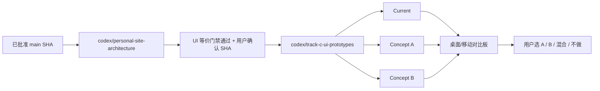

# Track C UI 原型计划

> **状态：待用户确认，不得直接实现。** 本计划重新审视旧 Track C，不把 2026-07-31 的视觉结论当成既定约束。原型只能从完成验证的架构 SHA 分支，在本地产生独立 HTML/dist/截图；用户选定 Concept 前不得覆盖公开页面、合并、push 或发布。

**基线：** `origin/main@74b531562ff14a5c38830c0edf88304af9f19933`

**原型分支：** `codex/track-c-ui-prototypes`

**前置依赖：** `codex/personal-site-architecture` 通过“公开 UI 等价”并由用户确认精确 SHA

**比较对象：** Current、Concept A（保守优化）、Concept B（结构重组）

---

## 1. 当前事实与证据

### 1.1 Current 的已确认结构

- 首页实际顺序：`Hero → Writing → Judgment → Works → Cases → Contact`。
- 顶部导航顺序为“判断 → 文章 → 作品 → 案例”，与页面视觉顺序不一致。
- Hero 强调 `AI · Product · Builder` 和写作定位，但首屏没有角色、代表作品、证据或最近更新时间。
- 第二屏已是 Writing；`featured-posts.json` 存在且首页/博客都读取它，旧 Track C 的“精选文章”不是从零开始。
- “我的判断”有 5 条，可展开看到文章/工具支撑；尚无统一的状态、证据等级与复核日期表达。
- Works 现有前三项已是 ESOP、A 股 AI 助手、Service Agent；“三个旗舰上移”不能再被解释为只调整当前列表顺序。
- `about` 锚点实际指向“我的判断”，没有真正作者介绍。
- Footer 的 AI 文案不构成充分的协作方法与责任边界披露。
- 博客共 39 篇：技术 19、产品 11、商业 2、行业 7；当前只有 1 篇精选。
- 非公开 portfolio evidence 示例将 ESOP、金融 RAG、Service Agent 标为 flagship；这只是内部示例，不等于用户批准的公开旗舰名单或指标。

### 1.2 视觉观察与限制

2026-08-19 只读实看覆盖当前线上桌面 `1440×900` 的浅色/深色：

- 浅色为暖色编辑风：Libre Baskerville、大号标题、陶土色姓名、羊皮纸背景；蓝色主 CTA 很突出。
- 深色切到冷蓝黑与蓝紫行动色，和浅色像两套品牌系统；辅助文字偏暗。
- 作品区是疏朗单列链接，对“真实案例、Demo、Mock、信息工具”的边界主要靠分组和描述，扫读成本较高。
- “精选”视觉强度有限；判断条目的日期、标签、序号和展开提示偏弱。

本轮没有成功取得移动端线上截图；以下是源码审计结论，必须在原型轮用真实浏览器复核：

- `≤768px` 隐藏观点标签、日期和展开提示。
- 博客 `≤680px` 隐藏整个侧栏，同时隐藏“← Leo Liu”返回入口。
- token 初筛：浅色 muted 对主背景约 3.31:1、陶土色约 3.54:1；深色 muted 约 2.54:1。它们提示普通文字可能不满足 4.5:1，但不替代逐元素浏览器审计。

### 1.3 三类核心访问任务

1. **招聘方 / 合作者：** 90 秒内确认是谁、做过什么、本人角色、哪些是真实或 Mock、证据在哪里。
2. **同行读者：** 找到代表性判断、文章系列和持续更新的观点。
3. **回访用户：** 快速进入最新文章、正在迭代的 Demo 或常用信息工具。

建议的可信度最小结构：

```text
公开主张 → 我的角色 → 可查看产物 → 指标类型/证据 → Mock/保密边界 → 最近复核日期
```
每个旗舰项目最多在卡面露出一条角色、一条证据、一条限制和一个明确入口，避免用徽章数量替代可信度。

## 2. 目标与非目标

### 2.1 目标

- 通过 A/B 对照回答：本站优先是“独立思想杂志”还是“AI Builder 作品证明”，以及两者如何排序。
- 让首次访问者能快速分辨作品类型、本人角色、真实/Mock 边界和证据入口。
- 改善博客 Start Here、精选、系列/主题与最新内容之间的导航。
- 在桌面和移动、浅色和深色下验证层级、对比、键盘、触控与阅读路径。
- 把旧 Track C 的每一项转为显式选择、风险与验收，不默认继承旧结论。

### 2.2 非目标

- 本轮不生成正式 Track C 页面，也不改公开 UI。
- 原型轮不修改工具核心业务、文章正文、公开 URL、canonical 或 localStorage。
- 不未经证据确认公开公司、客户、收入、准确率、用户量或影响指标。
- 不把内部 evidence 示例直接发布。
- 不统一重绘 8 个工具全页；先验证共享信任语言与壳层。
- 不安装/升级设计 Skill，不复制案例网站代码或视觉品牌。
- 不让 `.impeccable.md` 中旧 Track C 假设自动覆盖本轮选择。

## 3. 三方案定义

| 方案 | 信息架构 | 视觉策略 | 主要收益 | 主要风险 |
|---|---|---|---|---|
| Current | Hero → Writing → Judgment → Works → Cases | 暖色编辑主页、冷色科技深色 | 写作气质清楚；作为不可变参照 | Builder 证据埋在后部；Works/Cases/Tools 语义重叠 |
| Concept A | 保持大顺序；导航对齐；Works 内区分 3 个旗舰与 Labs；博客补轻量 Start Here | 保留现有字体、暖色与蓝色行动语义；修复对比/焦点/移动元数据 | 回归风险最低 | 作品仍不在第二屏，求职/合作证明改善有限 |
| Concept B | Hero → Selected Work → Judgment → Start Here/Writing → Labs → Experience → About/Colophon → Contact | 证据优先的编辑型作品集；旗舰用编号与类型标签 | 前两屏即可证明 AI/Product/Builder；结构最清楚 | DOM、锚点、内容确认和视觉回归面较大 |

**建议评审顺序：** B 是主评审候选，A 是安全对照；这不是预先选择 B。若北极星是求职、合作或专业背书，B 的信息架构价值更高；若主要目标是长期写作，A 更稳妥。

## 4. 旧 Track C 逐项处理矩阵

| 旧 Track C 项 | Concept A | Concept B | 预期变化 | 风险/门禁 |
|---|---|---|---|---|
| 1. 首页顺序 | 保持 DOM 大顺序，只让导航与页面一致 | 第二屏改 Selected Work，文章后移 | A 减少迷路；B 提前能力证明 | B 影响锚点和阅读习惯；必须 A/B 实看 |
| 2. Hero 定位与 CTA | 保留定位，压成一句承诺；CTA 为“读精选/看精选作品” | 明确“把 AI 产品判断做成 Demo 与长期文章”；作品主 CTA | 首屏能回答下一步 | 定位与 CTA 文案必须逐句确认 |
| 3. 蓝色改陶土色 | 不全局替换；蓝色保留行动、陶土保留编辑语义 | 可测试更深且合规的陶土主行动色，蓝色降为工具链接 | 减少色彩漂移 | 颜色须满足对比并双主题实看 |
| 4. Emoji 改编号/类型 | Labs 可保留 emoji，同时补文本类型 | 旗舰用 `01/02/03 + Demo/Case/Research`；emoji 仅辅助 | 提升专业度与扫读 | 全部删除会损失个性；辅助 emoji 应 `aria-hidden` |
| 5. 三个旗舰上移 | 当前前三不重排，只增加旗舰层级和证据字段 | 新建第二屏 Selected Work；Labs 不重复同一项目 | B 显著提升证明速度 | 名单、顺序、本人角色与可公开事实全需 HITL |
| 6. 判断精简/证据 | 默认 3 条 + 查看全部；移动不隐藏日期/状态 | Thesis / Evidence / Status / Last reviewed | 区分观点和事实 | 规则不清会制造伪权威 |
| 7. 博客 Start Here/系列/精选/时长 | 将精选扩至最多 3 篇并加 3 条人工策展入口；系列/时长后置 | Start Here → 系列 → 最新 → 全部；阅读时长由生成器算 | 39 篇不再平铺给新读者 | 策展会漂移；系列不能从标签自动猜测 |
| 8. 作者/Colophon/AI 披露 | Contact 前加短作者说明和可展开 Colophon | 独立 About/Colophon（架构允许时）；写清角色、方法、AI 与责任边界 | 主体可信度提升 | 隐私、客户/雇主与 AI 用法逐句确认 |
| 9. 字号/留白/对比/移动 | 保留字体，修 token、焦点、320px reflow、触控和移动元数据 | 重建排版比例和响应式栅格，统一双主题气质 | A 已能解决多数可用性问题 | B 像素回归面更大 |
| 10. Demo 视觉统一 | 只统一返回入口、类型、Mock/限制提示 | 先原型共享信任壳；核心操作区保留个性；全页统一后置 | 统一信任语言而非强行同皮肤 | 一次改 8 个工具风险最高，必须独立批次 |

## 5. 内容与视觉原型规格

### 5.1 Current

- 从 `74b5315` 生成静态参照，不做“顺手修复”。
- 固定当前文案、URL、字体、颜色、断点和交互。
- 与 architecture-current 做等价对比；两者不等价时先修架构，不进入 A/B 评审。

### 5.2 Concept A：保守优化

- Hero：保留视觉资产和大顺序，增加更明确的两条去向，不虚构证据。
- Writing：沿用现有精选机制，最多 3 篇；增加人工策展的 Start Here，不自动从热度推断。
- Judgment：默认 3 条、可展开全部，恢复移动端日期/状态可见性。
- Works：现有前三候选增加 `Demo/Case/Research`、角色、证据、限制；其他工具进入 Labs。
- Cases：若与 Works 重复，原型中测试合并提示，但不删除现有内容。
- About/Colophon：短版、可展开；所有雇主/客户/AI 描述使用占位符等待确认。
- 视觉：保留暖色编辑体系与蓝色行动语义，修正文案对比、焦点、字号和双主题一致性。

### 5.3 Concept B：结构重组

- Hero：一句价值主张 + 一条证据型副文案 + 作品/写作双入口；文案先用显式占位符。
- Selected Work：3 个旗舰项目，编号、类型、本人角色、证据/限制与主入口；不在 Labs 重复。
- Judgment：用 Thesis/Evidence/Status/Last reviewed 分层，避免把主观观点包装成结论。
- Start Here/Writing：策展、系列、最新与全部归档分层；系列由人工维护。
- Labs：承载信息工具、实验、研究导航，允许更轻松的 emoji/视觉个性。
- Experience：只呈现经用户确认、可公开的经历与职责，不把内部材料外推。
- About/Colophon：个人简介、更新方法、AI 协作、责任归属和站点技术说明。
- 视觉：证据优先的编辑型作品集；建立原创身份，不机械复制 Claude/Anthropic 或任何案例站。

## 6. 文件级影响范围

### 6.1 原型轮允许新增/修改的本地范围

- 本地忽略目录：`build/track-c-prototypes/current/`
- 本地忽略目录：`build/track-c-prototypes/concept-a/`
- 本地忽略目录：`build/track-c-prototypes/concept-b/`
- 本地忽略目录：`build/track-c-prototypes/screenshots/`
- 原型数据：经用户允许可在分支内新增 `prototypes/track-c/*.json|md|js`，但不得被 public manifest 引用。
- 对比测试：复用架构分支的 `tests/equivalence/`，可添加 Track C 专用场景与报告配置。

### 6.2 原型轮禁止修改

- `index.html`
- `assets/css/style.css`
- 现有公开 `tools/**/index.html`
- `scripts/public-dist-manifest.js`
- `dist/` 的正式部署语义
- `.github/workflows/**`
- `scripts/site-config.js` 的生产 canonical
- 正式文章 HTML/正文、生产 metadata、localStorage key。

选中 Concept 后，正式实施的文件范围必须由新计划/新批准确认，不能由本原型计划自动授权。

## 7. 分支、worktree 与依赖策略



- 原型分支必须从用户确认的 architecture commit 分出。
- Current 固定指向 `74b5315`；architecture-current 必须与其先证明等价。
- 原型只写本地临时目录；不进入公开 manifest，不从主页链接。
- 用户选择后另开正式 UI 实施批次；原型产物不能直接被复制进生产而绕过审查。
- 项目改名不与原型并行，以免把 URL/品牌差异混入视觉比较。
- 若计划文件尚未合并到 architecture 分支，从 planning worktree 的绝对路径只读加载；不得为获取计划而改变原型分支起点。
- C0 是只读决策门，不创建原型分支；用户完成 C-H1–C-H4 后，C1 才能从已确认 architecture SHA 建立 `codex/track-c-ui-prototypes`。
- C1 及以后必须使用 `/executing-plans`；生成可见原型前加载 `/impeccable` 与 `/shape`，生成后用 `/audit` 或 `/design-review`，完成前用 `/verification-before-completion`。

## 8. 执行批次（每批最多 3 项）

### Batch C0：冻结输入与内容事实，1–2 天

1. 复核三类用户任务与 Current 页面/状态矩阵，形成“思想杂志优先 / Builder 证明优先”的决策对照。
2. 从已验证证据整理旗舰候选、顺序、本人角色、可公开证据和 Mock/保密边界；未知项明确标空，不推断。
3. 交付 C-H1–C-H4 决策包与文案事实表并停止，由用户逐项确认。

通过条件：没有任何指标或履历来自推断，且用户已完成 C-H1–C-H4；未确认前不得进入 C1。

### Batch C1：Current 与 Concept A，2–3 天

1. 生成 Current 和 architecture-current，对等价差异先行清零。
2. 生成 Concept A 的独立首页、博客与代表状态。
3. 产出桌面/移动、浅色/深色的 A 对比报告与 a11y 初筛。

通过条件：Concept A 的每个变化均可追溯到矩阵项。

### Batch C2：Concept B，2–4 天

1. 生成 Concept B 的首页结构、Selected Work 与可信度字段。
2. 生成 Start Here/Writing、Labs、About/Colophon 的代表页面/状态。
3. 产出同视口 B 对比报告、五秒测试与风险清单。

通过条件：B 不虚构证据，不改变生产 URL/资源，不写公开文件。

### Batch C3：代表 Demo 信任壳，1–2 天

1. 为三项候选旗舰各生成仅本地的首屏壳层原型。
2. 比较返回入口、类型、Mock/限制、角色与证据表达；不改核心应用区。
3. 验证桌面/移动和首次交互前边界可见性。

通过条件：不试图一次统一 8 个工具全页视觉。

### Batch C4：选择板与 HITL，1–2 天

1. 汇总 Current/A/B 的同页同视口四联截图、DOM/URL/资源/功能差异。
2. 按“保留/选择/拒绝/待验证”列出所有设计决策和实现风险。
3. 用户选择 A、B、混合项或维持 Current；未选择时停止。

通过条件：没有 merge、push、workflow 或公开 UI 变化。

## 9. 测试与视觉验收

### 9.1 固定视口与状态

- 桌面：`1440×900`、`1280×800`。
- 移动：`390×844`、`320×800`。
- 每个视口：浅色/深色；字体加载完成；关闭 reveal/transition；数据固定。
- 页面：完整首页、博客默认/搜索/分类/分页、代表文章、三项旗舰首屏。

### 9.2 对比维度

| 维度 | 必须验证 |
|---|---|
| 截图 | Current / architecture-current / A / B 同页同视口；full-page 与关键组件 |
| DOM/语义 | landmark、标题层级、按钮/链接角色、链接文本、焦点顺序、ARIA |
| URL/SEO | 现有 URL、锚点、canonical 不发生意外变化；原型无生产 canonical |
| 资源 | 请求清单、零 404、零 console/pageerror、无新增未批准第三方 |
| 功能 | 导航、主题、判断/案例折叠、博客筛选/搜索/分页、文章 TOC/参考资料、Demo 主路径 |
| 内容可信度 | 指标有类型/来源/日期；真实/Mock/限制在首次交互前可见 |
| 五秒测试 | 能回答“Leo 是谁、哪三个代表作品、从哪里开始读” |

### 9.3 无障碍验收

- 320 CSS px 无横向滚动，文本放大不丢失功能。
- 键盘顺序符合视觉顺序，焦点始终可见。
- 普通文字对比至少 4.5:1；大字按 WCAG 规则验证。
- 触控目标至少 24×24 CSS px；主要按钮尽量达到 44 px。
- 减少动画设置生效；隐藏 emoji 不重复朗读。
- 自动 axe 只负责可自动发现问题；仍做键盘、缩放、触控和人工语义复核。

## 10. 回滚方案

- Current 永远来自冻结 baseline，不被 A/B 生成命令覆盖。
- A/B 输出使用不同目录，不共享会被原地修改的 CSS/HTML。
- 每个 Concept 独立提交原型源/报告（若用户同意跟踪），可以逐个 revert；本地输出可直接丢弃但本轮不删除任何文件。
- 若 architecture-current 与 Current 不等价，停止 Track C 并回到架构分支修复。
- 用户拒绝所有 Concept 时，公开站点保持 Current；原型分支不合并。
- 用户选择混合项时先生成第三轮合成对比，不直接拼接进生产。

## 11. HITL 节点

| 节点 | 需用户确认 |
|---|---|
| C-H1 | 北极星：思想杂志优先，还是 Builder 作品证明优先 |
| C-H2 | 旗舰三项、顺序、本人角色、证据和 Mock/保密边界 |
| C-H3 | Hero、CTA、“判断/作品/案例/Labs”命名 |
| C-H4 | 作者、雇主/客户、联系方式和 AI 协作披露 |
| C-H5 | 桌面/移动 A/B 选择板：A、B、混合或维持 Current |
| C-H6 | 选中 Concept 的正式实现范围 |
| C-H7 | 之后的 merge、push 与 Pages 发布，各自独立确认 |

## 12. 工作量与时间范围

- 原型准备与事实确认：1–2 天。
- Current/A/B 首页与博客代表状态：4–7 天。
- 三个旗舰 Demo 信任壳：1–2 天。
- 多视口/双主题验证和选择板：1–2 天。
- 合计约 **7–13 个工作日**，不含选中方案后的正式实现。
- 正式实现粗估：Concept A 4–7 天；Concept B 7–12 天；需在选择后重估。

## 13. 前台与 GitHub 影响声明

### 会影响前台的变化

- **本原型阶段不会影响前台。** A/B 仅是本地独立候选。
- 若未来选择 A：主要影响导航一致性、可信度字段、博客策展、对比/移动细节。
- 若未来选择 B：还会影响首页区块顺序、锚点、旗舰展示、About/Colophon 和内容层级。

### 不会影响前台的变化

- 本地 Current/A/B HTML、截图、diff、测试报告、事实表与选择板。
- 未被 public manifest 引用的原型数据与生成脚本。

### 是否需要更新 GitHub

- 原型阶段：**不需要，也不得 push 或发布。**
- 用户选择后是否提交原型源、建立正式 UI 分支、更新 GitHub，均需另行确认。

## 14. 对应的下一步执行 Prompt

```text
前提：codex/personal-site-architecture 已完成公开 UI 等价验收，我已确认精确 architecture SHA。

请先只读加载
D:\CS\Coding\qiuzhi\.worktrees\personal-site-planning\docs\plans\2026-08-19-track-c-ui-prototype-plan.md。
本轮只执行其 Batch C0，准备决策包后停止。不要创建原型 worktree/分支，不要执行 C1 或以后批次。

要求：
1. 按 AGENTS.md 读取共享上下文和相关 Skill；使用 /executing-plans、/brainstorming、/shape，并将旧 .impeccable.md 视为历史假设；
2. Current 事实基线固定为 74b531562ff14a5c38830c0edf88304af9f19933；只读取已通过等价验收的 architecture 报告，不生成页面；
3. 不创建 HTML/dist/截图，不修改 index.html、公开 CSS/工具、public manifest、workflow、canonical 或线上页面；
4. 不虚构指标、履历或证据；未知字段保持空白并列入问题，不以占位符绕过确认；
5. 输出北极星对照、Current 状态矩阵、旗舰候选事实表，以及 C-H1–C-H4 的逐项问题；
6. 不 merge，不 push，不部署。

结束时只提交决策包等待我确认。确认后，我会另发 C1 Prompt，届时才从 architecture SHA 创建 codex/track-c-ui-prototypes，并要求 /impeccable、/audit 或 /design-review 及 /verification-before-completion。
```
